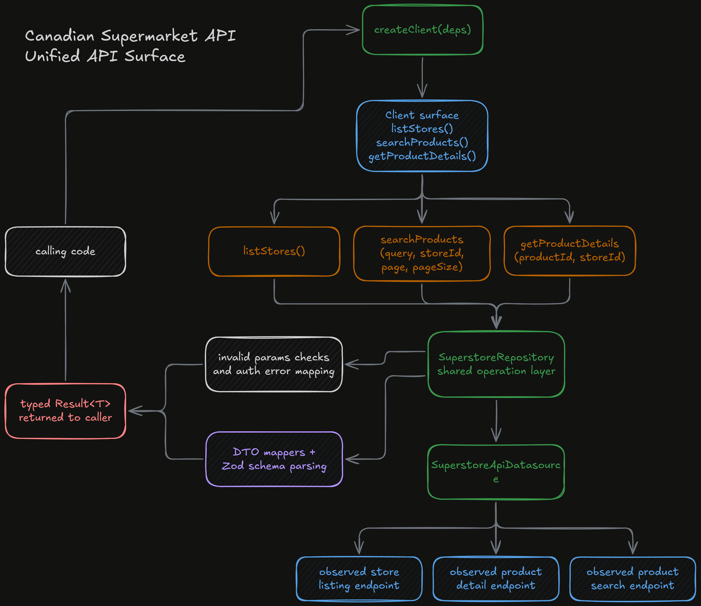

## Overview

Canadian Supermarket API is a TypeScript library built around a small set of observed Real Canadian Superstore endpoints. The scope is intentionally narrow: list available stores, search products within a store, and retrieve detailed product information for a given product-store pair. It's not an official commerce integration — the value is in turning a private, web-client-oriented API shape into a cleaner, typed package.

The whole idea is taking something awkward in its raw form, capturing the headers, payload rules, and response normalization required to use it, and wrapping those details behind a small client interface. The end result feels closer to a normal library than a set of fetch snippets copied from browser traffic.

The repo is also treated as a real packaging exercise. It has a public package surface, environment-driven configuration, DTO and domain schemas, mapping layers, and several layers of tests. Even though the feature set is small, I approached it as a client-design problem, not just a one-off reverse-engineering note.

## What It Wraps

The practical purpose is convenience. If an application wants to work with Superstore search results, there's a surprising amount of request knowledge to carry around: API keys, specific tenant and application headers, store-scoped search payloads, pagination rules, date formatting, and the difference between product summaries and detailed product lookups. Keeping all of that inline in each caller makes the code brittle quickly.

This package pulls it into one place. A caller can ask for stores, run a search against a chosen store, or inspect a product in more detail without rebuilding the request shape each time. The search flow is a good example — the datasource assembles the payload, including a generated cart ID and the expected fulfillment structure, before sending the request upstream.

It also works as a translation layer. The upstream responses are shaped around the original web API, not around a consumer-friendly domain model. The library turns those raw responses into typed store summaries, product summaries, and product detail objects, and returns them through a small `Result<T>` union so callers can handle normal values and typed errors without working directly against raw HTTP behavior.

## Client Surface

The first workflow is store discovery. `listStores()` retrieves the available pickup locations and normalizes them into a smaller store summary model — focused on the fields a consuming application actually cares about, like store identity, address information, geographic coordinates when present, and open-state information.

The second is store-scoped search. `searchProducts(query, storeId, page, pageSize)` requires a search term and a specific store context, then sends the request through the datasource using the headers and payload structure the upstream endpoint expects. The returned product tiles are normalized into product summary objects before being exposed publicly.

The third is product inspection. `getProductDetails(productId, storeId)` loads a fuller view of a product scoped to one store, again normalizing the upstream payload into a typed domain object. A caller can move from a search page into a more detailed view without building a second set of low-level requests.

The scope is still small, but the three operations fit together cleanly: find a store, search a store, and inspect a product within that store.

## Behind the Client

The code is organized around a port, repository, and datasource split. The datasource reaches the live upstream API. The repository translates datasource output into domain objects and maps transport-level errors into the public `Result<T>` shape. The public `createClient()` surface exposes those repository operations through a small client object, while top-level helpers provide a lighter functional API for callers who don't want to instantiate the client directly.

In the request pipeline, the datasource handles upstream concerns like environment or config-based API key lookup, request headers, payload construction, timeout behavior, and response parsing. It also contains the normalization logic that converts raw response records into DTOs, which are then mapped into the domain-level entities the package exports publicly.

Configuration follows the same pattern — the package can read from environment variables, but it can also be instantiated programmatically.

## Validation, Tests, and Limits

Validation is built into the flow as well. The repo uses `zod` schemas both around normalized DTO shapes and around the domain models that leave the repository layer, which gives the package a stronger contract than a plain TypeScript interface alone. The mapping layer isn't just renaming fields — it's checking that the transformed data still matches the shapes the rest of the library expects.

The core of the project is really the way it captures unofficial upstream behavior and turns it into a disciplined client interface. The search datasource is a good example — it encodes the specific literal headers and payload conventions the endpoint expects, including tenant information, application type, language handling, and request-body details like `offerType` and generated cart IDs.

The `Result<T>` response model also helps a lot here. Instead of forcing consumers to catch every error through exceptions or interpret raw fetch failures, the public API returns either `{ ok: true, value }` or `{ ok: false, error }`, which makes normal client behavior easier to compose, especially for invalid parameters, authorization problems, and not-found responses.

The test layout adds a lot of value relative to the project size. The repo includes unit tests for mappers, repositories, and use cases, contract tests for the public client API, and a live integration quickstart flow that exercises the real upstream service. The README is clear that these live runs require a real API key and that there's no offline fake datasource standing in for the contract and integration suites.

At the same time, the repo doesn't pretend the upstream is more stable than it is. It's a client around observed Superstore endpoints, not an official or guaranteed API. Search-rate-limit responses are currently flattened into an empty result at the datasource level, and the reported `total` count in the repository is the number of items returned in the current page, not a full upstream catalog count. For an experimental library, those are reasonable constraints.

## Signing Off

This one was mostly just fun. I liked the challenge of taking something that was clearly not designed as a clean public client and seeing how far I could push it toward one anyway. There is something satisfying about taking messy upstream behavior, figuring out what really matters, and turning it into an API that feels normal to use.

I also like that the project stays pretty honest about its limits. It is a small library around observed endpoints, not some grand platform. But as an exercise in reverse engineering, client design, validation, and packaging, it still says a lot about the kind of engineering work I enjoy doing.
