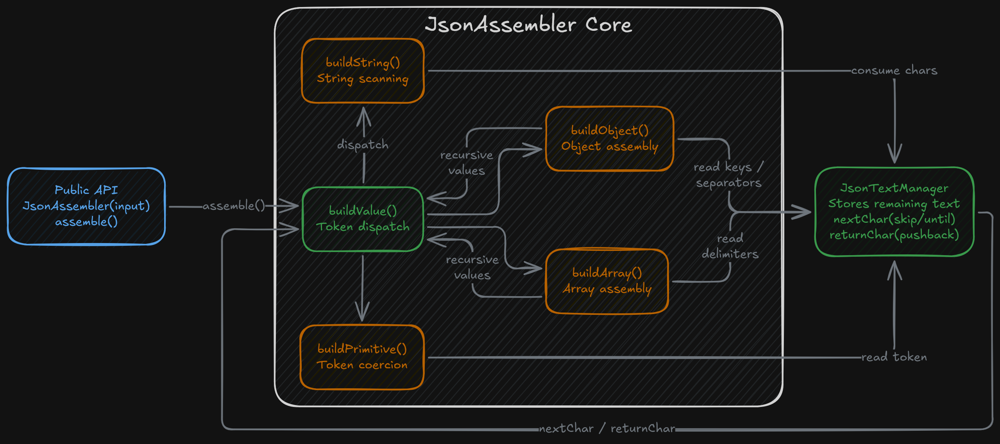
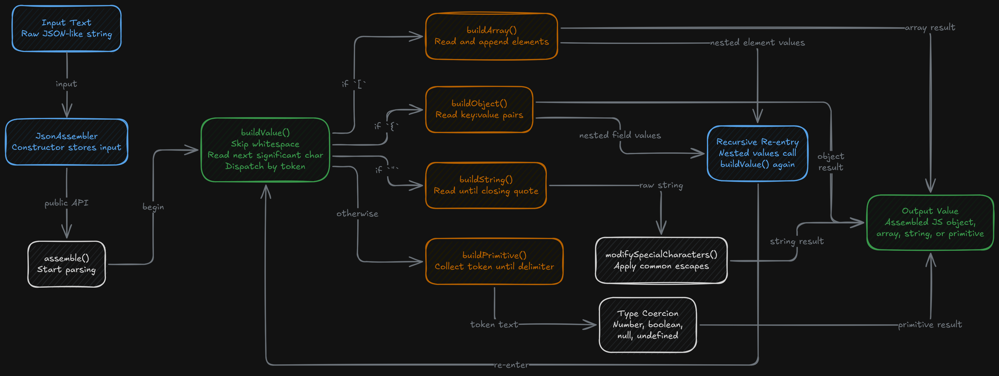
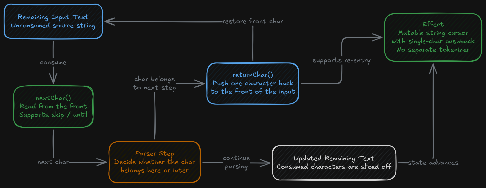

This project is a small TypeScript parsing utility that reconstructs JavaScript values directly from raw JSON-like text without calling `JSON.parse`. It's built around one exported class, `JsonAssembler`, which accepts an input string and incrementally assembles the corresponding value.

At the top level, the parser handles objects, arrays, quoted strings, and primitive values. The implementation is compact, but it includes the core mechanics needed to recursively rebuild nested structures from plain text.

## Overview

The parser works by reading the input one character at a time and deciding what kind of value should be built next. Instead of delegating to the platform's built-in JSON parser, it manually interprets the text stream and reconstructs the in-memory result through its own parsing methods.

The input is a string, the output is the assembled JavaScript value, and the parser itself handles consuming the text, tracking its place in the stream, and dispatching to the correct parsing path.

The public entry point is intentionally small. `assemble()` begins the process, and the rest of the parser is organized as a set of internal builder methods that each handle one kind of value.

## Parsing Model

The central dispatcher is `buildValue()`. It skips whitespace, reads the next meaningful character, and uses that token to decide whether the next value is:

- A string
- An object
- An array
- A primitive

This gives the parser a recursive-descent structure. When it encounters a nested object or array, it calls back into the same value-building path and continues assembling from the current point in the input. It can handle nested combinations of arrays and objects without needing a separate parsing stage for each level.

## How Values Are Built

Strings are parsed by reading forward until an unescaped closing quote is found. Once the raw string contents are collected, the parser converts common escaped characters such as newlines, tabs, backslashes, and escaped quotes into their in-memory representations.

Arrays are parsed by repeatedly reading the next element, pushing the first character of that element back into the input stream, and then calling the same value-building logic used at the top level. Parsed values are appended to a normal JavaScript array until the closing bracket is reached.

Objects are parsed by reading a quoted key, scanning forward to the colon, and then recursively parsing the value assigned to that key. Each parsed field is added to a plain object as the object body is assembled.

Primitive values are handled by reading forward until a delimiter is reached, then coercing the collected text into a more specific type when possible. Numeric text is converted into numbers, and the parser also recognizes booleans, `null`, and `undefined`.

## Distinctive Implementation Detail

Instead of keeping a numeric cursor index and advancing through the input with pointer arithmetic, the parser uses a helper class that stores the remaining unconsumed text and slices characters off the front as they're processed.

The helper also supports a simple one-character pushback mechanism. When the parser reads a character that belongs to the next parsing step, it can return that character to the front of the remaining input and let the next builder method consume it properly.

This keeps the parser easy to follow. The control flow stays local to the parsing methods, and it can move between reading, peeking, and recursive descent without introducing a separate tokenizer or a larger parsing pipeline.

## Supported Behavior

The project handles:

- Nested objects
- Nested arrays
- Mixed primitive types
- Escaped string content
- Empty arrays and empty objects
- Objects nested inside arrays and arrays nested inside objects

The included test suite exercises those cases across multiple combinations, which gives the parser coverage across the kinds of structures it is designed to assemble.

## Technical Character

This is a deliberately lightweight parser, not a full JSON validation engine. It focuses on reconstructing values from expected input, not on enforcing every strict rule of the JSON specification.

You can see that in a few places. The parser explicitly accepts `undefined`, which isn't part of standard JSON. Primitive number parsing is also permissive because it uses `parseFloat` rather than a stricter token validation step. It's more accurately described as a manual JSON-like assembler built for recursive value reconstruction than a standards-compliant parser.

## Project Structure

The repository is intentionally small:

- `src/JsonAssembler.ts` contains the full parser implementation
- `JsonAssembler` acts as the public parser class
- `JsonTextManager` acts as the internal character-consumption helper
- `tests/JsonAssembler.test.ts` exercises the parser against nested structures, escaped strings, and mixed values

The small footprint keeps it readable — the full parsing flow can be traced through one source file.

## Signing Off

At this point, AI has me hooked. I’m falling in love with generative technologies and what they could mean for software as a whole. There is really no way to know what the future holds, but having ideas pop up in front of me from an artificial brain is just wild. I realized pretty quickly that AI can do some remarkable things, but plugging it into usable applications is still a challenge. Streaming AI responses can make interactions feel responsive and fun, instead of making you wait 30 seconds for a full block of text to appear. I already knew AI could return JSON objects that we could parse and use, but I wanted to bridge the gap between real-time interaction, which you get from streamed text output, and structured JSON output. So I came up with an optimistic JSON parsing algorithm that can take in chunks and progressively construct valid JSON structures from a stream of AI-generated tokens. Not only does that make it possible to render structured outputs in real time with confidence, but it also helps correct some of the malformed JSON structures AI can sometimes produce.

This project was honestly just an official application of an algorithm I had built a while ago for some of my own personal projects, but it still ended up being a great academic showcase. It showed how something relatively simple, built around the rules of a predefined scheme like JSON, can be applied at a low level to create really interactive and genuinely cool applications.
