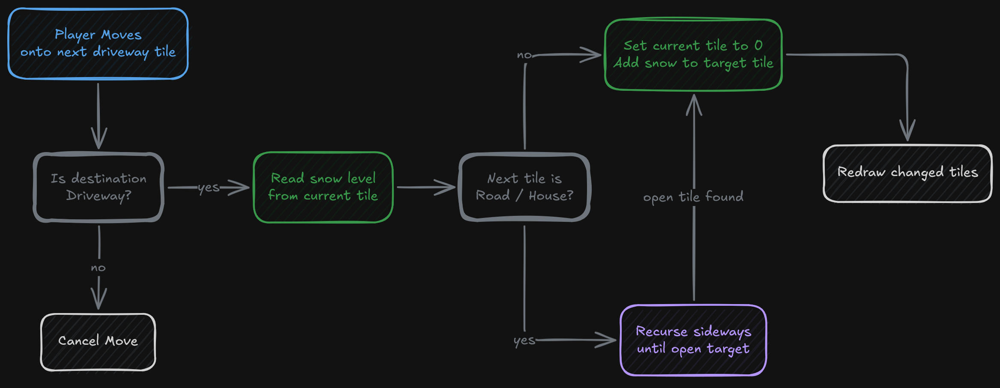
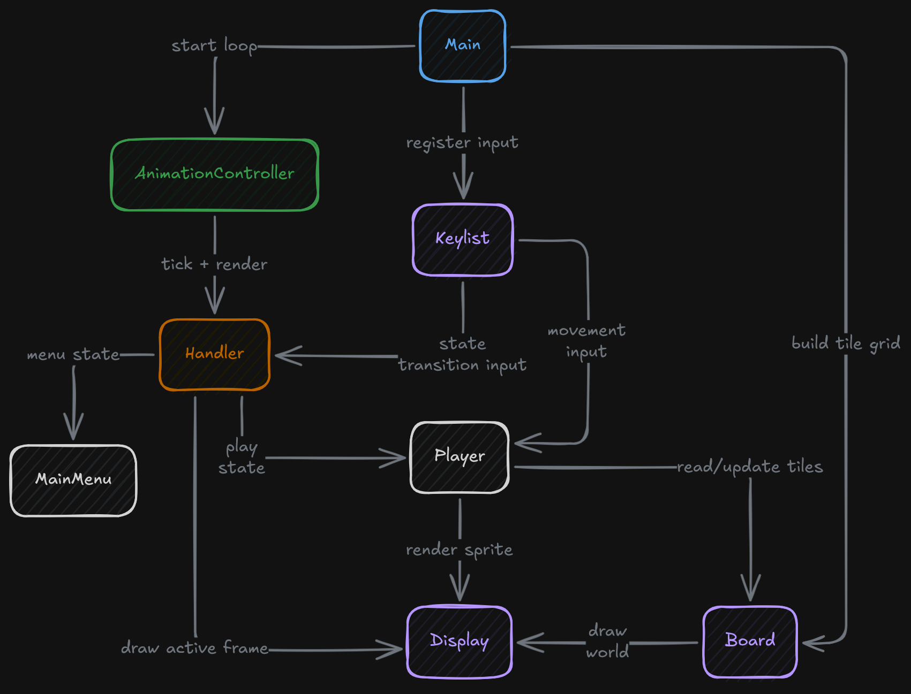
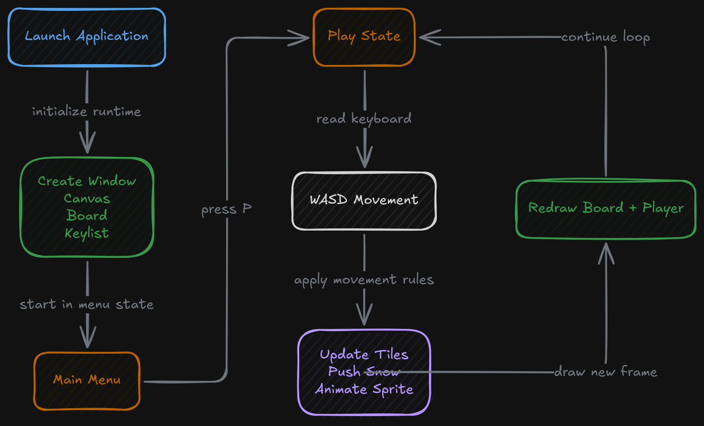

## Overview

Driveway Snow-Clearing Prototype is a small JavaFX game prototype built around one central interaction: moving through a snowy driveway and pushing accumulated snow across a tile-based map. It's structured as a local desktop application with a menu state, a play state, a custom render loop, and a grid-based world assembled from sprite assets.

The focus is narrow. The code is centered on world setup, input handling, tile updates, and the specific movement rule that lets the player push snow from one tile into another. It's a mechanics-first prototype, not a content-heavy game.

## World Layout and Tile Model

The map is assembled through a `Board` class that creates a fixed 28x20 grid of `Tile` objects. Each tile carries a `TileID`, a snow level, and a visual variant. During setup, the board assigns different tile types based on position:

- a road band across the top rows
- environment tiles along the outer edges
- house tiles near the bottom
- driveway tiles through the playable center

This gives the map a simple neighborhood layout instead of a blank rectangular arena. The board also introduces randomized tile variants during setup, so the driveway, road, and environment surfaces don't render as one repeated texture. Even though the world is fixed in shape, the variation makes the playfield feel less static.

Snow depth is stored directly on each tile. Instead of tracking snow as a separate particle or entity layer, it's treated as mutable tile state — movement changes the state of the tiles themselves.

## Player Movement and Snow-Pushing Logic

The main gameplay logic lives in the `Player` class. Movement is controlled with `W`, `A`, `S`, and `D`, and each movement attempt first checks whether the destination tile is a driveway tile. If it's not, the player doesn't move into it — the driveway is the actual playable corridor.

When the player moves, the game does more than update position. The movement path calls `push()`, which transfers snow from the current driveway tile into the next tile ahead. If the tile in front is blocked by a road or house, the method recursively continues pushing sideways until it finds a valid place to shift the snow. The map actively shapes how snow can be redistributed.

The recursive push behavior is the most interesting part of the prototype. The interaction is simple at the UI level, but under the hood it's based on chained tile updates rather than a single "clear tile" action. Snow is removed from the source tile, accumulated into the target tile, and redrawn immediately through the board/display path.

The player also uses offset-based interpolation for movement. Position updates happen on the grid, but rendering uses `iStepX` and `iStepY` offsets that are reduced over time, which makes each move animate across the tile rather than jump instantly from square to square.

## Rendering and Runtime Structure

Rendering is handled through a custom `Display` class built on a JavaFX `Canvas`. The display layer decides which image to draw for each tile based on both tile type and snow level. Driveway tiles switch between normal driveway sprites and snow-covered sprites as snow depth changes, while roads, houses, and environmental tiles each use their own image sets.

The player sprite is rendered separately from the board using directional and idle sprite sequences. The code keeps different frame arrays for front, back, left, right, and idle states, then chooses the correct sprite path based on the most recent movement direction and an animation counter — a basic but readable animation system tied directly to movement state.

The runtime loop is managed by `AnimationController`, which extends `AnimationTimer`. It targets a 60-tick update cadence, accumulates elapsed time into a `delta` value, runs game-state updates in `tick()`, and then renders each frame separately. It's structured as an explicit game loop, not just a collection of event callbacks.

At startup, the application creates the canvas, wires a `Keylist` event handler into the scene, initializes the board and player, and starts local background music from a bundled MIDI file. The whole program runs as one self-contained desktop runtime.

## Menu and Input Handling

The game starts in a menu state managed by `Handler` and `MainMenu`. The menu is drawn as a simple button list, and pressing `P` transitions the game into the play state. Once gameplay is active, the handler switches from menu rendering to board and player rendering.

Input is tracked through a dedicated `Keylist` object rather than direct one-off key checks. `Keylist` stores `Key` objects per key code, exposes both `isPressed()` and `justPressed()` checks, and lets the rest of the code distinguish between held input and edge-triggered input. It separates keyboard state tracking from gameplay logic.

The result is a small but complete local runtime loop:

- collect keyboard state
- update player and world state
- redraw the board and player
- switch between menu and play behavior through the handler

A clean gameplay skeleton, even though the feature scope is intentionally narrow.

## Signing Off

This project felt like the first time you ever baked something without following a recipe. It was a lot of fun, but the chemistry just did not add up, lol. This was a hackathon project, and with the heavy time constraints, it definitely put pressure on our team of three to come up with something memorable. We did not have the same polished game dev skills as some of the other competitors, but even so, we wanted to see what we could pull off within a fixed time frame. There were definitely some half-baked ideas in there, and while the character model got a few compliments, the overall feel of the game was honestly just lacking.

That said, this project still had a lot packed into it, just not at the standard I would have hoped for. Sometimes the lesson is not in the result, but in the nuances of the process. I learned just how far a solid structure and plan can take you when you are trying to pursue an arbitrary goal. I also learned how much work and effort goes into building the primitives of a game, things like rendering services, game threads, sprite animations, and physics engines. Hackathons are always a fun experience and a great way to test your mettle, as it were. I am really proud of the experience I got from this one and glad I took the time to playfully build something over a weekend.
