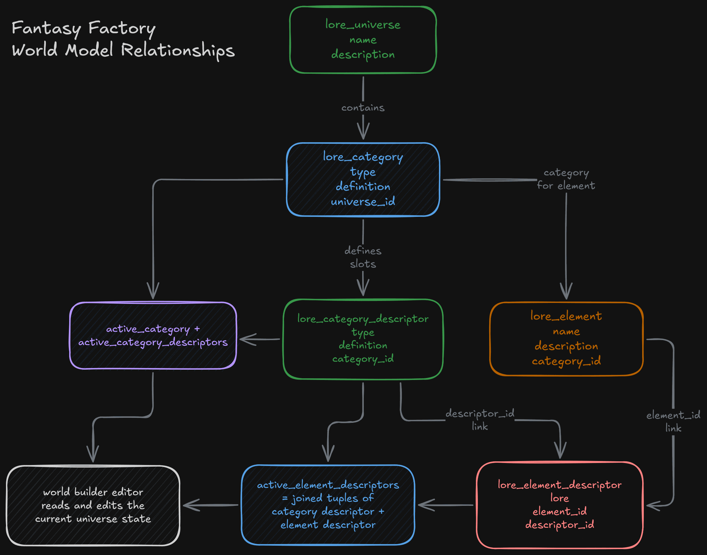
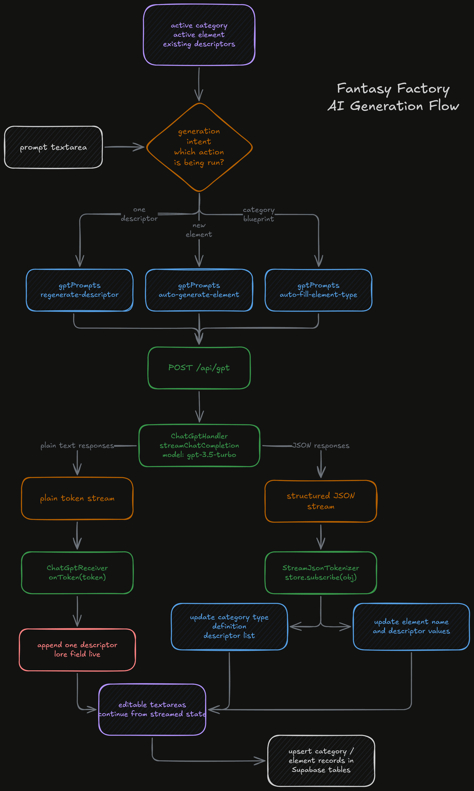

## Overview

Fantasy Factory is an authenticated world-building web application for creating and organizing fictional lore. The project is built around a persistent model of universes, categories, and elements rather than around a one-off prompt box. That distinction matters. Instead of asking a model for a block of fantasy text and copying the result into a document somewhere else, the application stores world-building information as a set of related records that can be generated, edited, revisited, and expanded over time.

The public landing page presents the project as a tool for imaginative creation, but the strongest evidence in the repository is the protected builder itself. Once a user signs in, the application exposes a dashboard and a set of detail pages for working through a structured hierarchy:

- universes as the top-level setting container
- categories as reusable lore types within a universe
- elements as individual entries inside a category

That hierarchy gives the project a clear purpose. It is not trying to replace writing entirely. It is trying to reduce the friction of getting a fictional setting established while keeping the user in control of the structure and the final wording.

## Why I Built It

The practical problem behind Fantasy Factory is that world-building usually starts from a blank page. That is manageable for a short idea, but it becomes harder when the goal is to build a setting with recurring types of information. A fantasy project might need places, factions, items, creatures, or characters, and each of those needs its own set of descriptive fields. A plain document does not enforce that structure. A prompt-only AI workflow does not preserve it especially well either.

Fantasy Factory solves that by making the structure explicit. A universe stores the broad setting. A category defines a type of lore entry inside that universe. Each category also has descriptors, which act like a reusable template for what should be captured about each element in that category. An element then fills those descriptors with actual lore. That means the app is not just generating text. It is generating text into a model that already knows how different parts of the world are supposed to relate to each other.

This is also what makes the project useful for tabletop or collaborative creative work. The goal is not only to invent content quickly. It is to keep that content legible and editable later. A generated location, creature, or artifact can still be revised by hand, descriptor by descriptor, instead of being trapped inside one large paragraph that has to be rewritten wholesale every time something changes.

## How You Build Inside It

The app starts with authentication. Supabase-backed sign-in gates access to the actual builder and supports multiple providers in the login flow. Once authenticated, the user lands in a dashboard-and-drawer interface that centers the rest of the project. The left-hand drawer acts as the navigation spine for the world model: select a universe, then a category, then an element, or create new ones directly from the same panel.

Creating a universe is the simplest workflow. A new universe record can be added, renamed, described, and deleted. This gives the project a top-level container for separating unrelated settings from one another instead of treating all lore as one flat list.

Category creation is where the system becomes more interesting. A category record stores its own definition, but it also owns a set of category descriptors. Those descriptors describe what kinds of information every element in that category should carry. A category might define recurring fields such as appearance, history, behavior, powers, or cultural role. The user can enter these descriptors manually, edit them, remove them, or ask the model to generate a category type, definition, and descriptor set automatically from a prompt.

Element creation then builds on that template. Each element belongs to a category, and each element receives a set of descriptor records linked to the descriptor definitions in that category. In practice, that means the user can create an entry such as a character, place, or creature and then fill in or generate its lore field by field. The element page also supports regeneration of individual descriptor content. If one part of an entry is weak, the user does not need to throw away the entire element. They can target only the specific section they want to rewrite.

The dashboard complements those detail pages by surfacing recently updated content. It groups universes with their recent categories and recent elements, which keeps the app feeling like an active workspace rather than a collection of disconnected forms.

## The World Model Underneath It

Fantasy Factory is built as a SvelteKit application with TypeScript, Supabase, and OpenAI-backed streaming generation. Under the UI, the project is really built around three responsibilities:

- authenticated route handling
- persistent lore storage
- streamed AI generation inside the editor

On the persistence side, the schema is explicit and relational. The main tables are `lore_universe`, `lore_category`, `lore_category_descriptor`, `lore_element`, and `lore_element_descriptor`. That structure is one of the strongest parts of the project. It turns a fuzzy creative problem into a real domain model. Universes contain categories. Categories define descriptor templates. Elements belong to categories. Element descriptors attach actual lore values to those templates. Because that structure is in the database itself, the app can treat world-building as a maintained dataset rather than as a pile of generated notes.

The client state mirrors that structure closely. The app uses a custom `SveltebaseTable` layer over Supabase tables, caching rows in `Map` stores and exposing simple `get`, `upsert`, and `delete` behavior. Derived stores in `loreStore.ts` then track the active universe, category, and element, along with the descriptors related to the current selection. This gives the UI a coherent state model without introducing a heavier state-management system. The relationship between route selection, persisted records, and active editing context stays easy to follow.

Route handling is also careful about the data model. Detail routes validate the incoming UUID query parameters before loading records, which keeps the builder from silently falling into a broken state when given invalid IDs. That is a small implementation detail, but it reflects the same general pattern as the rest of the app: the project is trying to preserve structure, not just render AI text.

## AI Inside the Editor

The AI side is kept behind a focused server route. `/api/gpt` accepts a message array and forwards it through a streaming OpenAI completion path. On the client side, generation is driven by prompt builders in `gptPrompts.ts`, fetch helpers, streaming receivers, and a custom tokenizer for streamed JSON-like output. The result is that AI generation lives inside the actual editing workflow rather than beside it.

The most distinctive design decision in Fantasy Factory is still the descriptor model. Many AI writing tools stop at "generate a result." This project goes further by deciding what kind of result should exist before generation starts. A category describes the shape of an element. The model then fills that shape rather than inventing an entirely new schema every time. That keeps the world-building process much more stable. A user can compare elements inside the same category because they are built from the same descriptor set.

The second distinctive detail is how streamed generation is handled. The app does not just wait for a response to finish and then dump text into the page. For category generation and element generation, the project uses a custom `StreamJsonTokinzer` to read streamed output and progressively place generated values into the correct editable fields. That is a meaningful implementation choice. It means the AI is feeding the editor directly instead of acting as a black-box text generator outside the editing surface.

That makes the regeneration workflow especially strong. On an element page, each descriptor can be regenerated independently through its own prompt, and the streamed output is written into that specific field. The user stays close to the data they are changing. They do not have to re-run the entire element or manually cut apart one large response.

Another nice characteristic is that the AI features sit inside a full application rather than inside a demo shell. The project includes authentication, persistent storage, route-based navigation, a dashboard, creation flows, edit flows, and deletion flows. The AI layer is important, but it is only one part of the system. The rest of the app exists to make that generated material manageable after the first prompt has already finished.

There are also some clear boundaries that help frame the project honestly. The landing page mentions future-facing ideas such as smarter context and image generation, but the strongest implemented evidence is the text-based lore builder itself. That is more than enough. The project does not need speculative features to be technically interesting because the implemented part already shows a clear attempt to merge structured data modeling with streamed AI-assisted editing.

## Signing Off

This one still feels pretty personal to me because it was never about using AI for the sake of using AI. The point was to make the early stages of world-building less annoying without stripping out the part that is actually fun. I wanted something that could help my friends and family who play D&D get lore moving quickly, but still let them shape it properly afterward.

Thats why the descriptor system matters so much here. The project doesn't just generate text and call it a day. It gives that text a place to live, a structure to fit into, and an edit path after the generation is done. For creative tools, I think that difference matters a lot. And I've seen it in the feedback of the people who used it.

Unfortunately I just didn't have the time to support it long-term and had to sunset the project as my API costs kept rising. Still worth the effort, and experiencing people's real time reactions seeing the power AI can bring them!
