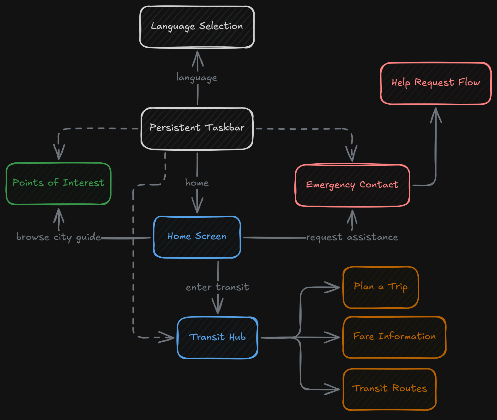
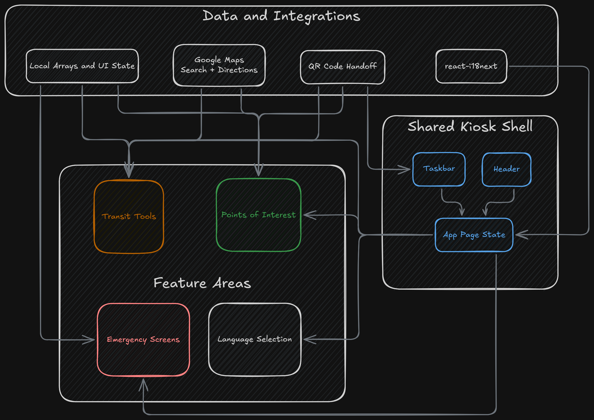
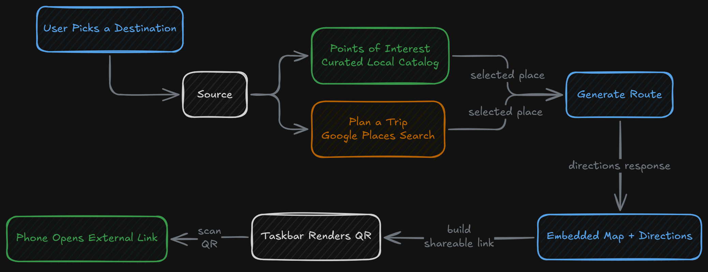

## Overview

This project is a touch-oriented React kiosk application designed to present transit, orientation, and emergency information for someone arriving in Calgary. The application is organized as a single-screen kiosk experience rather than a browser-style website. Instead of URL routing, the interface is driven by a single page state in `App.js`, and each major screen is swapped in place as the user moves through the kiosk. That keeps the navigation model simple and predictable, which matches the intended use case of a public-facing information terminal.

The home screen acts as the central entry point into three main areas: transit information, points of interest, and emergency contact support. A shared header and persistent taskbar keep those screens connected. The taskbar keeps the same core actions available throughout the application, including a return to the home screen, language switching, and QR output when a page has something that can be handed off to a phone.

## Navigation and Screen Structure

The application uses a state-based screen controller instead of `react-router`. Each page component receives `setPage`, and moving between screens is handled through explicit page names such as `Home`, `Transit`, `PointsOfInterest`, `Language`, `Emergency`, `TransitRoutes`, `FareInformation`, and `PlanATrip`. This gives the project a very direct kiosk-style control flow: the application always knows which full-screen view is active, and each screen is responsible for presenting one focused task.

That structure is paired with reusable framing components. The `Header` component provides a consistent title and back action, which gives the nested screens a stable "return" path. The `Taskbar` sits at the bottom of the interface and acts as a shared utility strip. When a page can generate a useful external destination, the taskbar switches from a disabled QR placeholder to an active QR code that can be scanned from a mobile device.

## Transit Features

The transit section is split into several distinct tools rather than one generic page.

`TransitHome` works as a small dashboard. It cycles through a local set of delay cards on an interval and also allows manual paging through them. Each card combines a route number, route label, and delay text. Under that rotating summary, the page branches into the rest of the transit tools: route and schedule viewing, trip planning, and fare information.

`TransitRoutes` presents a map and a rolling board of nearby route arrivals. The map is initialized through the Google Maps loader and centers on a fixed downtown Calgary location. The arrivals list is sourced from a local array and is paged in groups, which makes the page behave more like a compact kiosk board than a dense live-feed table.

`FareInformation` combines a fixed fare reference with a simple fare calculator. The page lists single-use, day-pass, and monthly prices across adult, youth, and child categories, then duplicates that structure in a calculator grid where the user can increment ticket counts and see a running total. The same page also exposes a QR handoff to Calgary Transit's fare purchase page so the kiosk can shift from information display to mobile follow-up without introducing payment logic inside the app itself.

`PlanATrip` is the most interactive part of the transit section. It uses Google Maps Places and Directions services to search destinations, select locations from search results or directly from the map, switch between walking, transit, and driving modes, and render a route on the embedded map. The directions panel does more than display a simple summary: it walks the nested Google directions structure recursively, so transit segments and sub-steps can be rendered as a readable step-by-step list inside the kiosk UI.

## Points of Interest and Emergency Tools

The `PointsOfInterest` page takes a different approach from `PlanATrip`. Instead of asking Google for a general text search, it uses a built-in catalog of Calgary destinations with names, coordinates, category labels, distances, and descriptions. That gives the page a curated, city-guide shape rather than an open-ended search box. Users can filter those locations by category, narrow them by distance with a slider, select a destination from the filtered list, and then request route directions to that place. Once a location is selected, the page switches from browsing mode into route-preview mode and can generate a QR code that opens the destination in Google Maps on a phone.

This combination of a fixed local dataset plus live route rendering makes the page distinct within the project. It is not only a map view and not only a directory. It behaves like a guided recommendation layer on top of a map service.

The emergency area is split into a contact page and a request workflow. The main emergency screen gives quick access to emergency-related information, while `HelpIsOnTheWay` simulates a simplified assistance request flow. In that screen, the user selects one or more response categories such as ambulance, police, or firefighters, submits or updates the request, and sees a timed progress state that transitions the screen from "submitting" into "help is on the way." The implementation is entirely front-end driven, but it still models the state changes of a guided request process instead of reducing the page to a static list of phone numbers.

## Language Support and Mobile Handoff

Language switching is a visible part of the kiosk design rather than a hidden settings page. The language screen presents a grid of options and routes the selection through `react-i18next`. The interface is wired so localization is available application-wide from startup, and the selection flow returns the user to the home screen after confirmation.

The language list itself is larger than the currently active translation set. The screen presents a broad set of language names, but the implementation applies English and Korean as the working options while routing unsupported choices into a modal message. That makes the language page part navigation surface, part roadmap for future internationalization.

The QR behavior in the taskbar is another recurring system in the project. Rather than embedding full mobile workflows directly into the kiosk, pages can hand off a destination or purchase link by rendering a QR code in the persistent bottom bar. That pattern appears in route planning, points of interest, and fare information, and it gives the kiosk a consistent way to bridge from a shared public screen to a personal device.

## Signing Off

This was the result of an iterative approach to UX/UI design. From wire diagrams, to mockups, to prototypes, this project really captures that evolution. It highlights some of the core fundamentals of UX and applies the UI testing needed to make sure the interface is accessible, intuitive, and functional. A lot of the codebase itself is not super spectacular, but where this project really shines is in the decisions behind exactly how the UI is meant to behave, what it is supposed to do, and the different circumstances under which users will interact with it.

This project and process taught me that UI and UX go way beyond “just make it pretty, dur.” There is intention, along with frameworks, systems, and processes, that can make good UI feel much more deterministic. Good UX, though, is an art form that can take a lot of time to truly nail down, and I can feel myself being pulled toward the challenge of mastering it.
