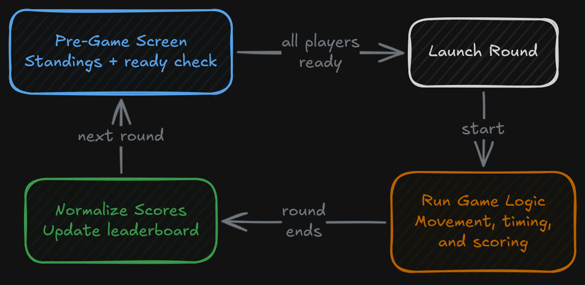
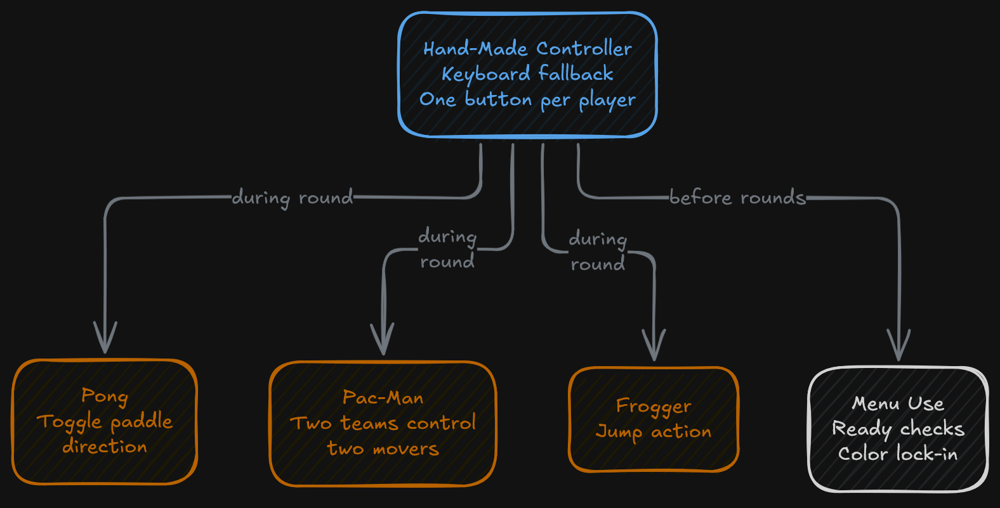
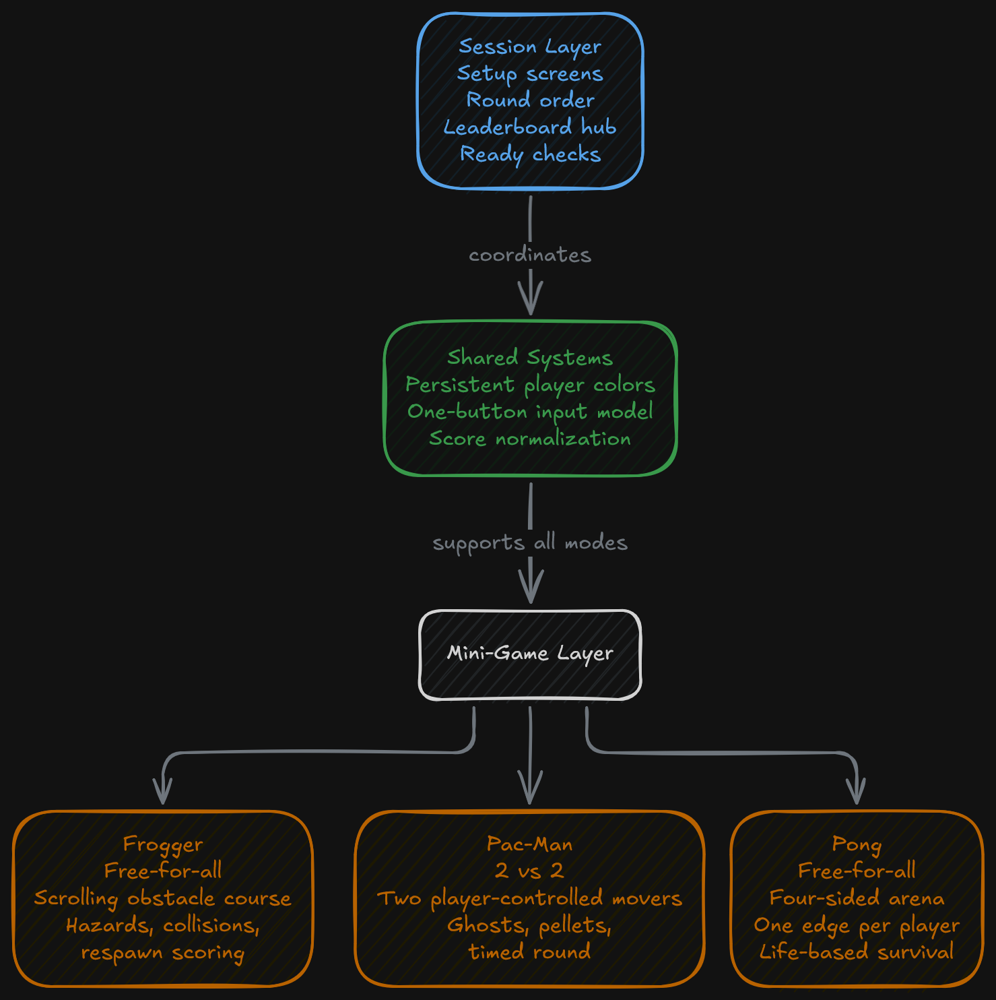

Pixel Party is a local four-player Java desktop arcade bundle that combines Frogger, Pac-Man, and Pong inside one session-based application. The program moves players through a shared setup flow, runs a randomized sequence of rounds, and keeps player color and score consistent across the session.

## Overview

Pixel Party is organized as a single local multiplayer session rather than as three separate games launched independently. The session begins with an opening screen, a rules screen, a character-selection step, and a pre-game setup screen before the active game container is launched. Once the session starts, the program runs three mini-games in sequence: Frogger, Pac-Man, and Pong.

The order of the three rounds is randomized before play begins. That order is shown to the players on the leaderboard screen, and the same screen is used between rounds to show updated standings and prepare the next game.

Each player selects a distinct color before the session starts. That choice carries forward into gameplay, so the same player identity is preserved between setup screens and the mini-games. The project uses that color choice as part of the session structure rather than treating character selection as a one-off menu detail.

The three game modes do not use the same rules. Frogger and Pong run as free-for-all rounds. Pac-Man runs as two teams of two. Between rounds, the application returns to a shared leaderboard and ready-check screen before launching the next game.

## Session Design

One of the defining characteristics of the project is its one-button control scheme. Each of the four players is assigned a single key (`Q`, `R`, `U`, `P`), and the application uses that limited input set across menus and gameplay. Those simple key mappings mirror the hand-made controller setup built for the project, so the same one-button-per-player model can be used with the physical controller or directly from the keyboard. The same button is used for ready checks before rounds and for in-game actions once a round starts.

That constraint gives the project a very specific design shape. Instead of building separate, complex control mappings for each mini-game, the code organizes each mode around simple, readable input behavior that can be reused across the full session.

The pre-game screen also includes a "How To Play" view tied to the upcoming round. That keeps the transition between setup and gameplay inside the same flow rather than pushing players into separate instruction screens for each mode.

## Shared Systems

The menu and session code manages the main window, screen transitions, round startup, round completion, and leaderboard updates. A shared set of support classes handles persistent player state, input abstractions, score normalization, and sprite recoloring. Each mini-game then keeps its own runtime logic in a separate package.

The leaderboard is part of the application flow rather than an afterthought at the end of a match. After each round finishes, scores are parsed, converted into session points, and added back into the running totals before the next round begins. The session can also be replayed with a new random game order while keeping the running score history active.

Sprite recoloring is another notable shared system. After players lock in their colors, those selections are passed into the shared player state and reused inside the games so each player keeps a consistent visual identity.

## Runtime Details

The project uses Java SE with Swing and AWT rather than a dedicated game engine. UI screens are built directly as desktop panels, and gameplay relies on custom thread loops for movement, timers, collision checks, animation, and score updates.

Common runtime features across the project include:

- Multi-screen UI flow
- Shared player color and score state
- One-button input handling for four local players
- Sprite recoloring tied to character selection
- Round-by-round session scoring

Each mini-game builds on that shared base in a different way:

- Frogger uses a scrolling obstacle course with moving hazards, collision checks, respawn behavior, and finish-order scoring.
- Pac-Man uses two player-controlled Pac-Man entities, ghost movement, pellet collection, timed round logic, and team score handling.
- Pong uses a four-sided arena where each player controls one edge and loses lives when the ball escapes their side.

## Signing Off

This is where I was no longer a boy and became a man. In middle school, I learned programming almost exclusively through Java, and because of that, I got bored pretty quickly with CLI and terminal-based interactions. I wanted something more. That is when I discovered Swing, Java’s GUI toolkit. I used Swing back in middle school to build my first basic, and honestly pretty ugly, GUI-based applications. This project was the next step up and took things to a whole new level. The introduction of graphically custom-styled menus, sprites, interactive elements, isolated render and game threads, and so much more was exactly the upgrade I needed to realize both the limits of Swing and the limits of my own understanding when it came to building interactive applications in Java!

It was so much fun making a video game feel like something special with my own personal spin on it! This project gave me the chance to work in a team setting, the first real team-based software project I had ever done, and create something beautiful and memorable. Definitely one for the memory books!
