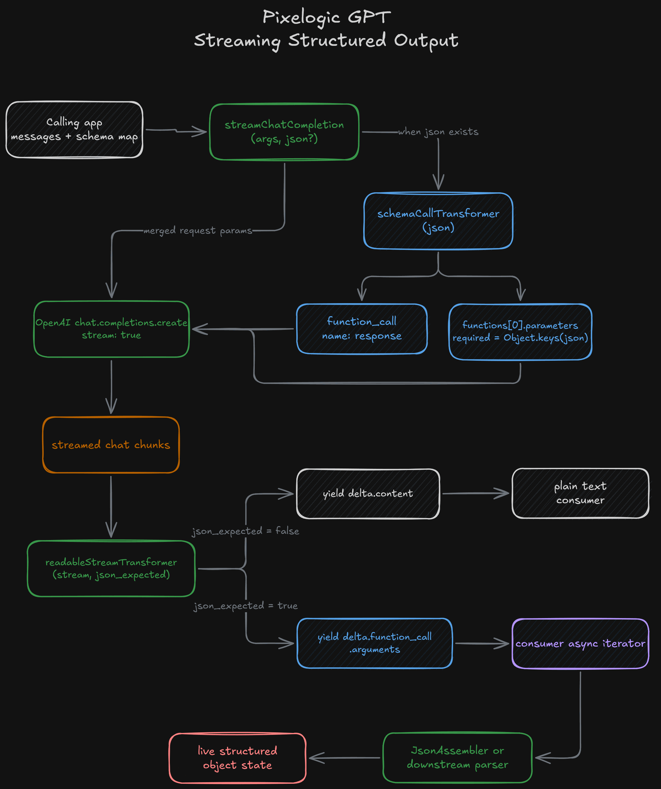
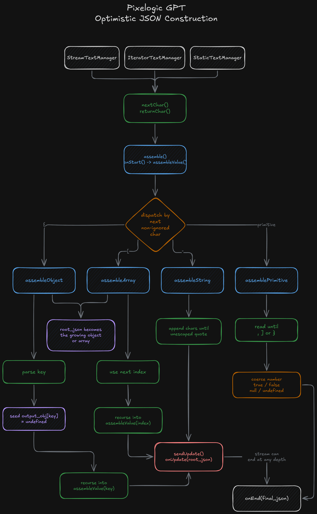

## Overview

Pixelogic GPT is a small TypeScript package built to reduce the repeated setup work around OpenAI chat integrations. Instead of leaving each project to recreate the same client wiring, schema-shaped response setup, streamed output handling, and partial JSON reconstruction, the package separates those concerns into two exports: `PixelogicGpt` and `JsonAssembler`.

That split gives the project a clear library shape. `PixelogicGpt` is responsible for making chat completion calls and exposing a consistent interface for static and streamed responses. `JsonAssembler` is a lower-level parsing utility that rebuilds objects directly from JSON text or streamed fragments. Together, they cover a problem that shows up often in AI-enabled applications: it is easy to ask a model for structured data, but it is much harder to consume that structure cleanly once the response starts arriving incrementally.

The project is intentionally narrow. It is a reusable package for a specific class of integration work: send chat requests, optionally ask for a predictable shape, and make the response easier to consume in real applications.

## Why It Exists

The practical goal behind the package was to make later AI features easier to wire into software without rewriting the same integration code over and over. One part of that problem is request ergonomics. A caller needs to initialize the OpenAI client, pass chat completion arguments through, optionally define a response shape, and then capture token usage in a way that is easy to inspect. The other part is response handling. Plain text can be streamed directly into a UI, but structured output becomes much more awkward once it is split across many small fragments.

Pixelogic GPT addresses both sides of that problem. `PixelogicGpt` wraps the completion call itself and exposes a small, direct API. `JsonAssembler` focuses on reconstruction, accepting full text, iterators, or stream readers and rebuilding JavaScript values from those inputs. The two responsibilities stay separate, which keeps the library small while still making it flexible enough to reuse in different kinds of applications.

## Public API Surface

`PixelogicGpt` is built around the OpenAI Node client, and its surface is intentionally small. `chatCompletion()` accepts standard chat completion arguments and optionally takes a schema map describing the expected response shape. When a schema is provided, the wrapper converts that map into a single function definition named `response`, sends it with the completion request, and then parses the returned `function_call.arguments` text through `JsonAssembler`. In the static case, the caller gets a normal JavaScript object instead of a raw JSON string.

The library also carries token counts alongside the response shape when those numbers are available from the OpenAI client. That is a small detail, but it makes the package more practical for experiments where prompt and completion usage matter.

## Streaming and JSON Assembly

The streaming path uses the same overall approach, but it keeps the streamed form visible to the caller. `streamChatCompletion()` returns an async generator rather than assembling the full result internally. For plain text completions it yields content fragments. For schema-shaped responses it yields chunks of the function-call argument string. That is a useful decision because different applications want different behavior at that stage. Some want to render the stream immediately. Some want to buffer it. Some want to progressively rebuild structured state.

That matters because streamed structured output is usually awkward at the application layer. A UI can render plain text token by token easily, but it cannot do much with a half-finished object unless something is rebuilding that object while the stream is still in flight. `JsonAssembler` provides that missing layer. It also exposes `onStart`, `onUpdate`, and `onEnd` callbacks, so downstream code can react to partially assembled JSON instead of waiting for the stream to finish.

The test suite reinforces that same focus. `PixelogicGpt` is exercised across static and streaming paths, including schema-shaped responses, while `JsonAssembler` is tested against nested JSON through text input, iterators, and stream readers. That is good evidence for how the package was meant to be used.

## Design Boundaries

One important boundary in the implementation is that the schema map is a request-shaping convenience, not a full runtime validation system. The package helps the caller ask for structured output, but it does not try to become a broader JSON Schema enforcement layer. That narrower scope fits the rest of the design.

Because the wrapper and parser are decoupled, the package also avoids forcing one usage style. A caller can use the OpenAI wrapper alone, the parser alone, or the two together. That is why the project reads as a reusable library instead of a handful of utilities copied out of a single application.

## Signing Off

Honestly, this was one of those smaller packages that ended up being more useful than its size suggests. A lot of AI work gets annoying not because the hard part is unsolved, but because the same bits of plumbing keep showing up every time. This was my way of taking that plumbing seriously and pulling it into one reusable place. I used this within some of my professional showcases, although it quickly got outmatched by other larger teams making better abstractions and frameworks for AI orchestration & management.

But that is why I like it, its honest about what it is. It is not trying to be some giant framework. Its just a focused library that makes OpenAI integrations cleaner and streamed structured output easier to deal with, and sometimes thats all you need.
