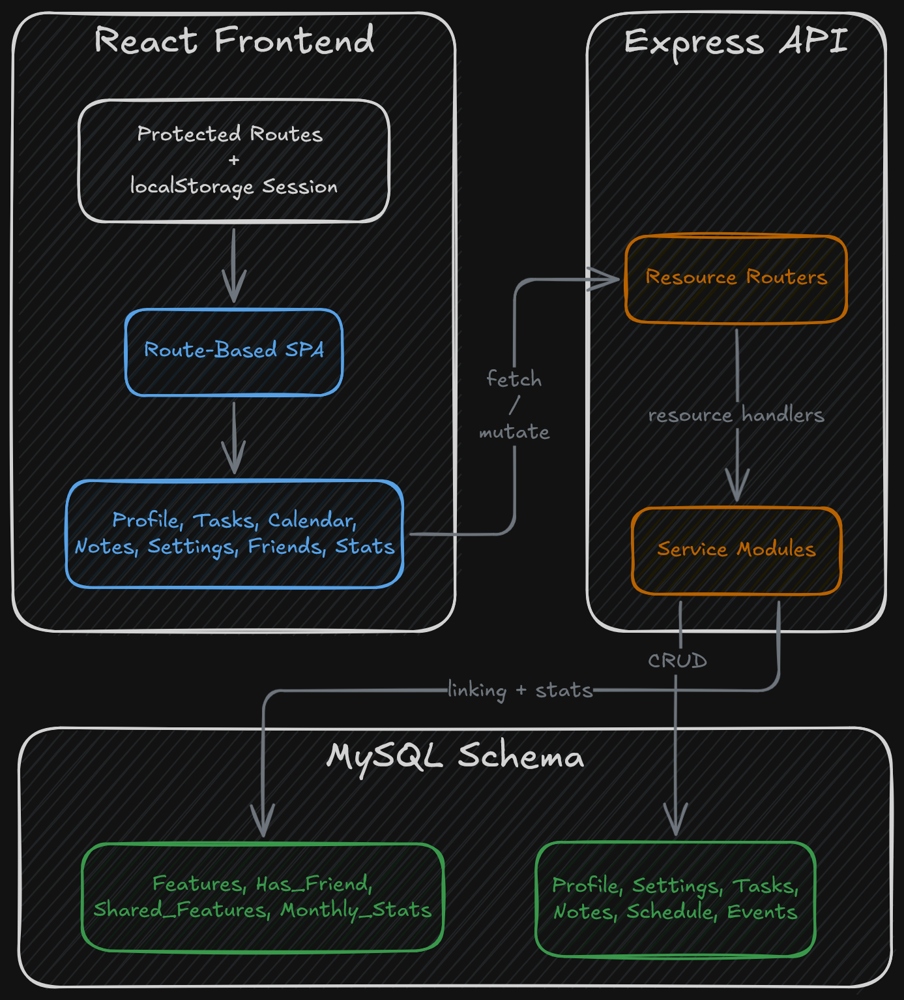
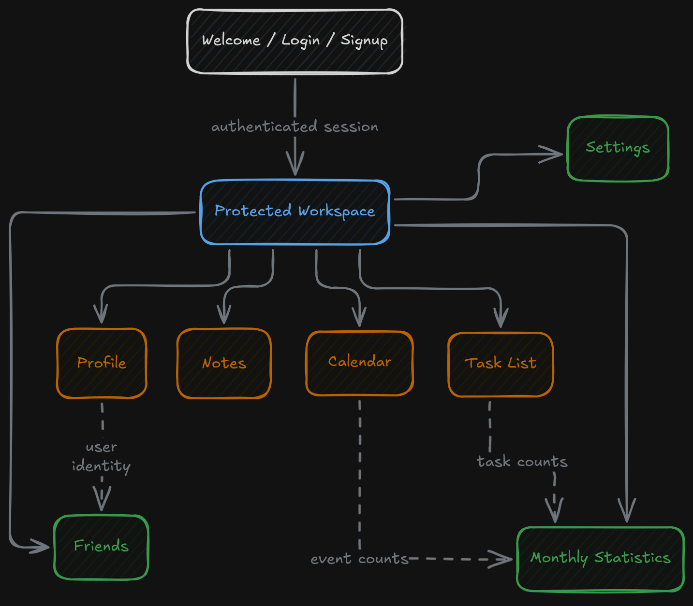
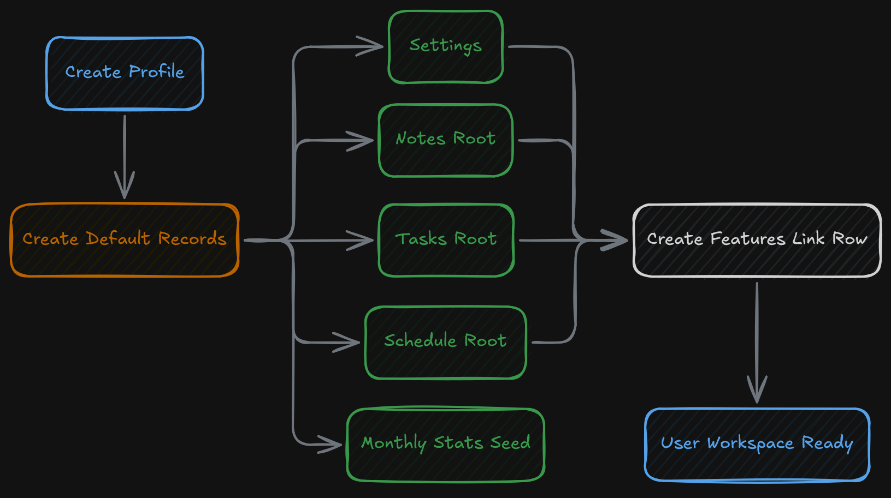

## Overview

This project is a full-stack web application that combines several personal organization features into one account-based system. Instead of separating scheduling, notes, task tracking, profile management, and friend connections into unrelated tools, the application keeps them under one user record and one shared interface — a locally run productivity platform with a small social layer built around the same data model.

At the repository level, the project is split into three main parts: a React frontend, an Express API, and a MySQL schema defined through SQL scripts. There's also an older `client` folder that appears to be an earlier or partial frontend branch, but the main application is the `Front_End` project paired with the `api` server.

## Frontend Application Structure

The frontend is a React single-page application organized around route-based pages. Public entry points include the welcome screen, login, and signup. Once a user is considered logged in, the application routes into a protected set of pages for profile management, tasks, calendar, notes, settings, friends, and statistics. Access control is handled on the client side through a `ProtectedRoute` wrapper that checks for a stored user record in `localStorage` before allowing access to the main application pages.

The layout is organized as a multi-page dashboard. Shared navigation is provided through a persistent navbar, while each route focuses on one part of the user's data — it feels like a connected workspace rather than a collection of isolated forms.

The UI implementation mixes several styling approaches. Some sections use plain CSS files, some use utility-class-driven layout in the calendar area, and some feature-specific screens are built with `styled-components`. The task, notes, and settings pages are where this mix is most visible, with screen structure composed from reusable styled wrappers and custom UI pieces.

## Productivity Features

The task list is implemented as a CRUD workflow backed by API calls. The page loads the user's task collection, displays the existing items, and supports creating, updating, completing, and deleting tasks. Each task can carry a title, description, location, deadline, and completion state. The page also manages edit flow in the UI by temporarily disabling the main form while an existing task is being edited, which keeps creation and modification paths from colliding.

The notes feature uses a two-pane layout with a notes sidebar and an active note editor. Notes are created inside a user-owned notes collection, and the page supports adding new notes, selecting the active note, deleting notes, and updating the title or body content. Each note also records created and modified timestamps, so the page tracks editing history at the record level rather than treating notes as anonymous text blocks.

The calendar is the most structurally distinct feature in the frontend. It uses a custom month grid, a dedicated sidebar, a header, and a modal-based event editor. Instead of relying on a third-party calendar widget as the main interaction surface, the project renders its own month layout and uses a React context layer to coordinate calendar state such as the current month index and whether the event modal is visible. Events include title, description, location, day, start time, end time, and a label value, which gives the calendar more structure than a basic date marker.

Settings and profile pages extend that same pattern of user-owned data management. The profile page presents editable account details such as name, birthday, email, username, password, and profile image upload. The settings page is tied to a dedicated settings record and includes fields for date format, time format, timezone, language, theme, country, and notifications. Together, those screens make the application feel more like a personal workspace with account configuration rather than only a task tracker.

## Social and Shared Features

The social layer is lightweight but visible. The friends page allows the user to search the profile directory, add direct friend relationships, and remove them later. The relationship is modeled as a join table in the database — it stores actual user-to-user links, not just a UI list.

The schema also includes a `Shared_Features` table with permissions for view or edit access across users. The frontend doesn't appear to expose that entire sharing model directly, but the structure is present in the database design. Feature sharing between users was part of the broader system design, even if the full front-end surface for it isn't built out the same way as the core productivity pages.

The statistics page is another cross-feature view. In the UI it's relatively simple, but the backend includes a `Monthly_Stats` table, and the frontend task and event update paths call into that tracking flow when records change. Statistics are tied back into the application's create/update behavior, not just a static display.

## Backend and Data Model

The backend is a Node.js Express server organized as a set of resource-specific routers and service modules. Rather than a monolithic controller or a general-purpose ORM, the API is broken into endpoints for resources like profile, settings, tasks, task, notes, note, schedule, event, friends, features, shared features, and monthly stats. Each resource has its own route file and service layer, making the API structure easy to follow from the repository layout.

On the data side, the schema is centered on the `Profile` table. From that record, the rest of the application branches into related data:

- `Settings` stores account-level preferences.
- `Tasks` and `Task` store task collections and individual task entries.
- `Notes` and `Note` store note collections and individual notes.
- `Schedule` and `Event` store calendars and event entries.
- `Has_Friend` stores direct links between users.
- `Monthly_Stats` stores per-user monthly counts.
- `Features` stores the active linked IDs for the user's main productivity records.

The `Features` table is an interesting part of the design. Instead of repeatedly resolving each root record independently, the application uses one linking row to keep track of which schedule, notes collection, task list, and settings record belong to the current user — a central lookup path for the rest of the user's feature data.

## Authentication and Session Handling

Authentication is lightweight and mostly client-managed. The frontend stores a user block in `localStorage`, uses that to gate protected routes, and performs profile-related requests directly against the API. Password hashing is handled with `bcryptjs`, but it's triggered from the frontend request layer during signup and profile updates — some credential handling logic lives in the client rather than being concentrated entirely on the server.

The signup flow also does more than create a profile record. It bootstraps the rest of the user's default workspace by creating or linking the initial settings, notes, task, schedule, and statistics records. Account creation is part of the application's core data orchestration, not just a single insert into the profile table.

## Signing Off

I mean, we’ve all been there, right? If you haven’t tried making a to-do list or productivity app as a software developer, are you really a software developer? All jokes aside, this was definitely a cliché I needed to take a stab at. I went in with high hopes and honestly was not that let down. I’m proud of what my team and I were able to accomplish given the time constraints, especially with some of those 4 a.m. overnight sessions on campus. I realized fairly quickly just how much work it takes to build a feature-rich calendar, note-taking app, and task tracker. It sounds simple at first, but getting everything to orchestrate together is a whole other beast entirely.

It was a great experience being able to flesh out my React skills, learn more about backend server hosting, and better understand all the interesting nuances that go into high-quality state management wrapped in an appealing user interface.
