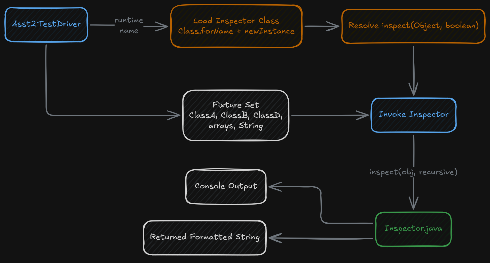
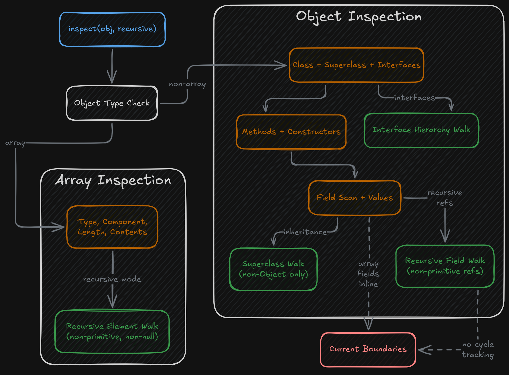
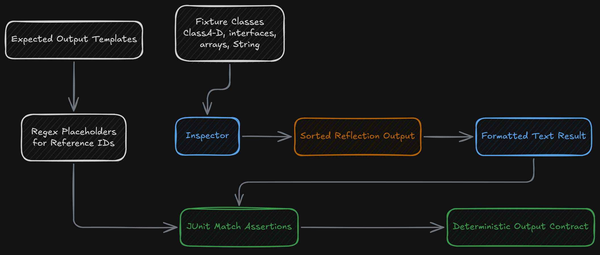

## Overview

This project is a Java reflection utility that inspects arbitrary objects and renders their structure as formatted text. The goal isn't just to read type metadata — it's to walk through an object in a way that makes the result understandable and testable. The implementation reports class information, declared methods, constructors, interfaces, fields, arrays, and selected nested object structure from a single inspection entry point.

The repository includes an older sample inspector implementation, but the main custom work is in `Inspector.java`, which replaces the minimal sample behavior with a broader inspection routine and a deterministic output format that can be validated in unit tests.

## Runtime Model

The main runtime entry point is `Asst2TestDriver.java`. Instead of hard-coding one inspector class, the driver loads an inspector by name at runtime with `Class.forName`, instantiates it reflectively, finds an `inspect(Object, boolean)` method, and invokes that method against a fixed set of test fixtures. The driver itself is a reflection exercise — the inspected objects are discovered statically in the test list, but the inspector implementation is loaded dynamically.

The driver runs the inspector against a varied set of targets:

- simple objects
- inherited objects
- one-dimensional arrays
- two-dimensional arrays
- a built-in `String`

This fixture selection forces the inspector to handle both user-defined types and standard library objects, as well as both scalar objects and arrays.

## Reflection Output

The custom inspector is organized around one public method, `inspect(Object obj, boolean recursive)`, which returns a formatted string while also printing the same structure to the console. Returning the string is important because it gives the project a clean testing surface — instead of only producing console output that has to be checked manually, the inspector accumulates the formatted result internally and exposes it for assertions.

For non-array objects, the inspector reports the following major sections:

- class name
- immediate superclass
- implemented interfaces
- declared methods
- declared constructors
- declared fields

Each of those sections is generated through Java reflection APIs, and the implementation sorts interfaces, methods, constructors, and fields before printing them. The sorting step is important — it turns what could be unstable reflection output into a deterministic representation that can be compared across runs and tests.

The method output includes return type, parameter types, exception types, and modifier flags. Constructors are formatted with parameter types and modifiers. Fields are printed with type, field name, value, and modifiers. The implementation also normalizes array type names so that array-valued types are displayed in a readable `Type[]` form instead of raw JVM descriptor syntax wherever possible.

## Recursive Inspection Behavior

The inspector supports both recursive and non-recursive modes. In non-recursive mode, it reports the immediate structure of the object being inspected. In recursive mode, it expands that view in several ways.

If a field contains a non-primitive object reference, the inspector can descend into that referenced object and inspect it as its own structured block. It also walks upward through the inheritance chain when the inspected class has a superclass above `Object`, and it expands interface hierarchies by listing interface methods and fields as part of the recursive type view.

The output follows a depth-first traversal:

- inspect the current object
- inspect nested non-primitive field values
- recurse into non-`Object` superclasses
- recurse into implemented interfaces

This moves the project beyond simple reflection metadata and into object graph exploration, at least for acyclic structures.

## Arrays and Value Formatting

Arrays are handled as a separate inspection path. When the inspected object is an array, the inspector reports:

- the array type
- the component type
- the array length
- the array contents

In recursive mode, non-null, non-primitive top-level array elements can be inspected individually. For direct field output, array values are formatted into a string representation rather than recursively expanded in place. Object arrays use `Arrays.deepToString`, while primitive arrays use special-case formatting logic.

The formatting logic for object values is deliberate. Primitive wrappers, characters, booleans, strings, and nulls are rendered directly. Other object references are rendered as a compact identity string using the class name plus the object's identity hash — enough information to distinguish object references without trying to serialize the object itself.

One boundary in the current implementation is that recursion does not track previously visited objects. That means the traversal is depth-first, but it is not cycle-safe. Another boundary is that primitive-array formatting is only explicitly implemented for `int[]`, with other primitive arrays falling back to a more generic string path.

## Access Control and Reflection Constraints

The field inspection path explicitly calls `setAccessible(true)` before reading field values, allowing the inspector to reach private fields when the runtime permits it. The project also handles `InaccessibleObjectException` and access failures explicitly, so the inspector can continue and emit a readable failure message instead of crashing when the JVM refuses access.

The output reflects both the object structure and the runtime environment. When private data can be read, it's shown. When module or accessibility boundaries prevent access, the output records that constraint as part of the inspection result.

## Testing Surface

The repository includes a substantial JUnit test suite in `InspectorTest.java`. The tests validate the formatted output against expected strings for multiple fixture cases, including custom classes, arrays, and standard library types. Because some object references include runtime-specific identity values, the test suite uses regex placeholders to normalize those unstable segments instead of comparing them literally.

Reflection output is often treated as a debugging artifact, but here it's converted into a repeatable output contract. The tests aren't just checking that the program runs — they're checking that the reflected structure is presented in a stable, expected format.

The fixture classes in the repository support that test surface intentionally. The class hierarchy and interface relationships provide enough variation to exercise:

- inheritance
- implemented interfaces
- object-valued fields
- null references
- array fields
- modifiers and access patterns

A compact but meaningful object model for the inspector to work against.

## Signing Off

This project was an excellent way to familiarize myself with reflection and how it can be used practically. In this particular instance, it was mainly used to print object values and fields as strings for the sake of inspection and observation, but the underlying principles go much deeper. 

Having the ability to traverse the relationships and characteristics of objects that exist within a virtual space opens the door to all kinds of meta-operations. For example, it is what allows diagramming tools to effectively map out and visualize complex codebase relationships automatically.

There were definitely some challenges when it came to applying the lessons to the project, but it was valuable nonetheless!
