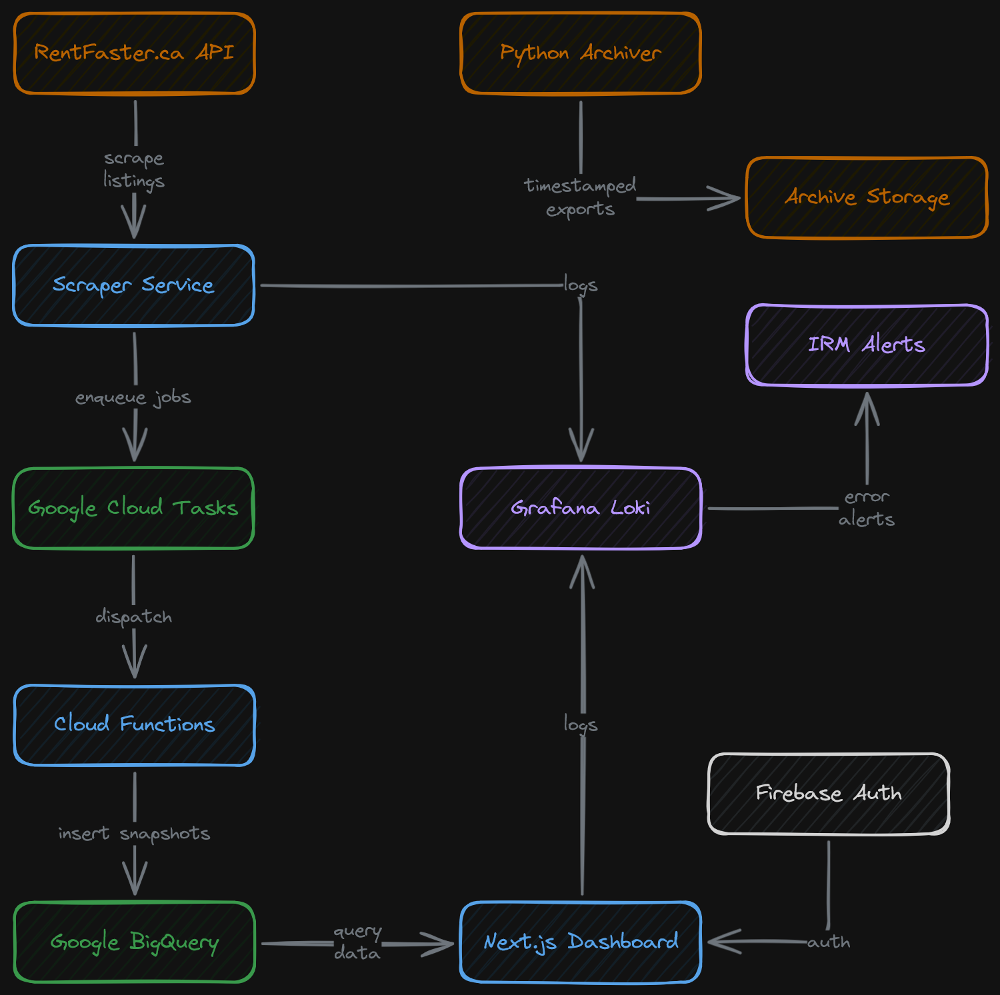
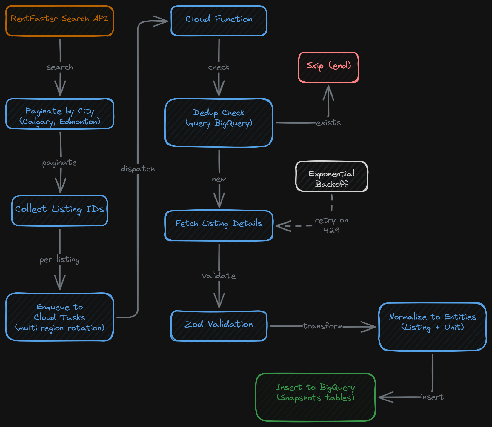
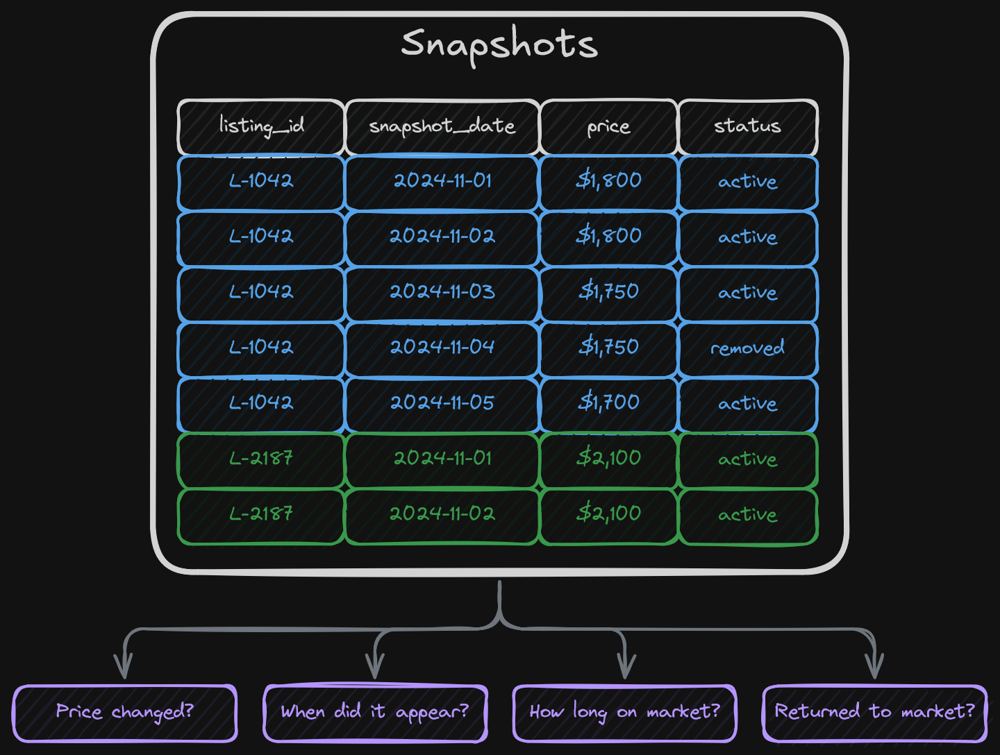
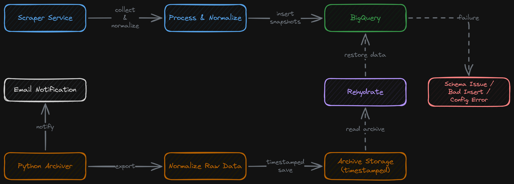

## Overview

This platform was built for a rental market client who wanted to systematically track and analyze the Calgary and Edmonton rental markets. It ended up spanning two interconnected systems: a scheduled ETL pipeline that scrapes rental listings from the RentFaster.ca API, normalizes the data, and stores daily snapshots in Google BigQuery, and a Next.js analytics dashboard that turns all that data into market trend visualizations, listing history, and export tools.

Each repo handles a different half of the problem. The scraping side collects data reliably at scale, which means dealing with pagination, rate limiting, distributed task queuing, deduplication, and normalization. The dashboard side makes that data useful through analytics charts, authentication, filtering, listing detail pages, and the export tools the client actually uses day to day.

Both systems are running in production, which meant putting real thought into observability and recovery. Both ship structured logs to Grafana through OpenTelemetry, IRM notifications fire when errors surface in the pipeline, and there's an automated backup and archiving layer that keeps raw scraped data separate from BigQuery. If something needs to be rehydrated, there's always a path back.

## The ETL Pipeline

The data collection side is a TypeScript/Node.js service designed to run on a schedule. The flow at a high level is: search the RentFaster API for active listings across both cities, collect the listing IDs, and distribute individual processing jobs for each one. Those jobs fetch full listing details, check for duplicates, normalize the data into a consistent entity shape, and write everything into BigQuery as daily snapshots.

The architecture underneath is more layered than that summary makes it sound. The search step paginates through results city by city, accumulating listing IDs until pages come back empty or the consecutive-failure threshold gets hit. For each listing, rather than processing inline, the pipeline enqueues a task into Google Cloud Tasks pointing at a Cloud Function endpoint. The region for each task gets rotated across multiple Cloud regions to distribute the processing load, which keeps any single region from bottlenecking when thousands of listings are being dispatched at once.

Rate limiting is a constant concern when you're working against a public-facing API at this scale. RentFaster blocks bare HTTP clients, so every outbound request carries browser-like headers. The pipeline also implements exponential backoff with a 10-second initial delay, a 2x growth factor, and up to 10 retries. There's a deliberate delay before the very first request too, just to look less like an automated job hitting the API at full speed. A dedicated `TooManyRequestsError` type gets thrown on 429 responses specifically so the retry logic can handle rate limits separately from other failures.

Deduplication runs before any insert. For each listing ID and snapshot date, the pipeline queries BigQuery first to check whether that record already exists. If it does, the job exits early without inserting anything. This means the pipeline can be re-run or retried on the same day safely, which matters when Cloud Tasks occasionally retries individual jobs for its own infrastructure reasons.

Zod schemas are used throughout. Every API response gets parsed against a schema before any of it touches the database layer, so malformed upstream data fails loudly rather than silently writing garbage into the dataset.

## The Snapshot Model

One design decision that shapes everything downstream is treating each collection run as a snapshot rather than a point-in-time upsert. Every listing and every unit written to BigQuery gets stamped with a `snapshot_date`. The database isn't storing the current state of a listing. It's storing the state of that listing on a specific date, every day the pipeline runs.

That's what makes the analytics work. Because there's a record for every day a listing was observed, the data can answer questions about how a listing's price changed over time, when it first appeared and when it came off market, whether it returned after being removed, and how long individual units have been sitting without moving. A flat current-state model can't answer any of those questions. The snapshot model can.

Zod entity schemas do double duty here. They define the data shape in TypeScript for validation, but they also drive BigQuery table creation through a `zodToBigQueryField` utility that converts the schema directly into BigQuery field definitions for the `ListingSnapshots` and `UnitSnapshots` tables. The TypeScript schema, the runtime validation, and the database structure all stay in sync from one source of truth instead of getting out of sync.

## The Dashboard

The frontend is a Next.js 15 application using React 19, Firebase Auth with OIDC middleware for session management, and Recharts for the visualizations. Route protection is handled at the middleware layer. Unauthenticated users get redirected to login, and authenticated sessions pass into the main app. The auth uses cookie-backed OIDC tokens rather than relying on client-side session state alone.

There are twelve separate analytics endpoints backing the dashboard, each one a distinct view into the data:

- **Volume count**: listing and unit counts over time
- **Volume change**: the delta in active listings across periods
- **Volume count by type**: inventory broken down by property type
- **Price distribution**: histogram of asking prices across the market
- **Price directionality**: counts of listings where price moved up vs. down over the window
- **Price directionality by type**: that same split, filtered by property type
- **Price per square foot distribution**: PPSF spread across the current inventory
- **Inventory age distribution**: how long listings have been sitting on market
- **Availability window**: how quickly available units are being claimed relative to when they appeared
- **Returns to market**: listings that went inactive and came back
- **Unit active age stats**: duration that currently listed units have been visible
- **Unit removed age stats**: age at removal for units that have left the market

Each endpoint accepts the same set of filters: time range, community, property type, price range, and listing status. They all run through a shared `ListingFilterModel` parsed from query params on each request, so the same filter context applies across all the charts at once.

There's also a paginated listing browser with search and filters, along with detail pages for individual listings and their associated units. A listing's detail page shows price and status history across the snapshot window, contact information, photos, and attached unit records. Export tooling lets the client pull snapshot data out as CSV downloads, with both full dataset exports and per-listing exports running through dedicated API routes backed by an async job queue.

The UI was as much of a focus as the data work. Radix UI handles the component primitives, Tailwind handles the styling, and React Hook Form with Zod backs the form inputs. The goal was a dashboard that felt like a real analytics tool with proper time range controls, clear chart labeling, and filterable views. Not a data dump with no thought put into how someone would actually navigate it.

## Observability and Alerting

Both systems ship logs to Grafana Loki through OpenTelemetry. The logging setup is the same across the scraper and the dashboard: a `Logger` facade over a handler that routes entries through configured exporters. In production those exporters are a console writer and a Grafana OTLP exporter that communicates with Loki over HTTP. Log entries carry a `caller` field for tracing the source, structured `data` payloads serialized to JSON, and severity levels that map to OpenTelemetry's `SeverityNumber` enum.

In practice, that means both the pipeline and the frontend are visible in one place. Grafana shows what the scraper's doing in real time: how many listings are being processed, where retries are happening, which cities are being worked through, and whether anything's failing. The frontend logs its own errors too, so API route failures and data-fetching issues land in the same stream alongside pipeline activity.

IRM notifications are wired to error-level events. If the scraper starts hitting repeated failures or the pipeline starts producing errors, an alert fires. The client doesn't find out a week later that several days of data are missing. They know about it the moment it starts going wrong.

The Grafana exporter also truncates log payloads over 200KB before sending them. At the volumes the scraper produces, debug entries can get large when they're carrying full listing data, and oversized payloads will crash the exporter. Truncating keeps logging working under load without dropping entries.

## Backup and Archive

There's also a Python archiver script that runs on its own schedule and maintains timestamped exports of the collected data separately from BigQuery. It handles the normalization that comes with real-world data: price ranges arrive as strings like `"$1,200-$1,500"`, dates need serialization, booleans come through as integers in some fields. It writes the cleaned outputs into a timestamped archive folder.

Each archiver run writes its own log file alongside the data exports, so there's a full trail of what was collected and when. Email notifications go out on completion or failure, giving the client a paper trail outside of Grafana to follow.

The whole point of this layer is defensive. If something goes wrong in BigQuery (a schema issue, a bad batch insert, a config problem that blocks the pipeline), there's a separate archive of raw collected data to fall back on. You can fix the pipeline and rehydrate the database from the archive without losing whatever window of data was affected. A BigQuery problem doesn't have to become a data loss problem.

## Signing Off

This one felt different to build because it's actually running and being used. Every day the pipeline runs, listings get collected, and the client's pulling from the dashboard to understand the market they're watching. That's a different feeling than finishing a project and moving on!

The part I'm most proud of is that we didn't stop at "the pipeline works." Getting data into BigQuery was the beginning, not the finish line. The observability setup means we know the moment something breaks instead of finding out days later. The backup layer means a pipeline failure doesn't necessarily mean lost data. The snapshot model means the dashboard can answer questions about trend and history, not just what the market looks like right now.

There's something satisfying about building a system where the reliability thinking and the product thinking are both genuine. The dashboard is a real analytics tool that someone uses to make decisions. All the infrastructure around it, the logging, the alerting, the archive, that's what lets it actually stay useful once it's shipped.
