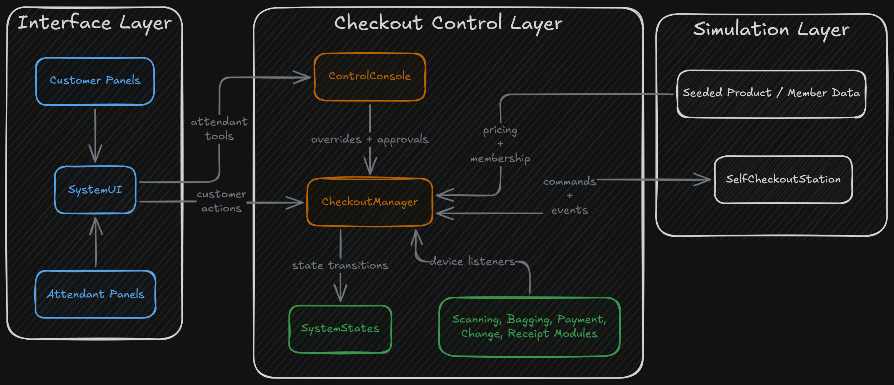
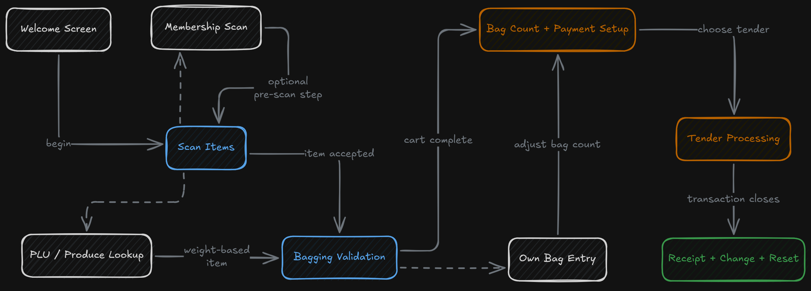
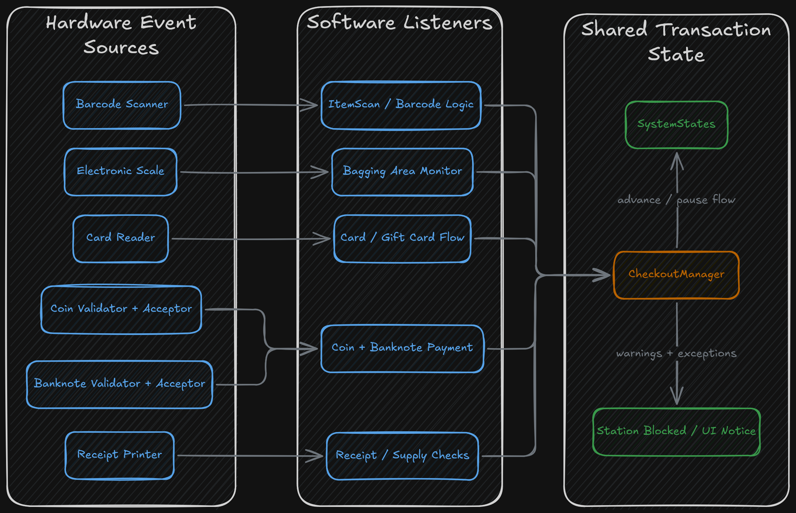

This project is a Java desktop simulation of a retail self-checkout station built on top of a provided hardware model. It combines customer-facing checkout flows, attendant controls, hardware event listeners, payment handling, bagging validation, and Swing-based UI screens inside one local application.

The active software lives in the main implementation tree, while the repository also keeps the supplied hardware simulator, a deprecated software branch, and planning diagrams from the original project work. The core of the project is the software layer that sits on top of the simulated station and turns individual hardware devices into a full checkout workflow.

## Overview

The application models the experience of using a self-checkout station from both the customer side and the attendant side.

On the customer side, the flow starts at a welcome screen, moves into item scanning, supports membership entry and produce lookup, enforces bagging checks, and then transitions into payment. The payment process supports cash, card, and gift-card flows, followed by receipt printing and change return when needed.

On the attendant side, the software includes a separate control surface for login, station power, block and unblock actions, discrepancy approval, printer maintenance, and dispenser refill actions. That makes the project more than a single checkout screen. It models both the station interaction and the operational support layer around it.

The result is a simulation that behaves like a product surface rather than a collection of disconnected device handlers.

## Software Structure

The main implementation is organized into two major application layers.

The `software` package contains the checkout logic. This is where transaction state, customer actions, device listeners, scanning behavior, bagging validation, payment handling, change return, receipt printing, and in-memory data setup are managed.

The `gui` package contains the customer and attendant interfaces. These Swing panels are coordinated by a top-level UI controller that switches views, updates prompts, refreshes the cart display, and presents notifications when the station needs attention.

At the center of the logic layer is `CheckoutManager`, which acts as the main transaction coordinator. It tracks the current cart, totals, and transaction state, and it registers the listeners that connect the software to the simulated devices.

The attendant side is centered around `ControlConsole`, which wraps a full station and exposes the control operations needed to supervise, unblock, and maintain the checkout process.

## Checkout Workflow

The checkout flow is built as an explicit state-driven system. The software distinguishes between phases such as being ready for a customer, scanning, waiting for bagging confirmation, produce lookup, bag selection, payment, and change dispensing.

That state model shapes the UI and the device behavior at the same time. A scan does not just add an item to a list. It changes the expected weight, updates the transaction, disables scanning until the bagging step is resolved, and pushes the system into the next required state.

The scanning interface keeps a running cart and total while also supporting several side paths:

- Membership entry
- Customer-owned bag handling
- PLU produce lookup by code or keyword
- Transition into payment
- Item removal when an attendant is logged in

The payment interface continues that same structured flow. Before final payment, it includes a plastic-bag counting step. It also allows the customer to return to scanning before committing to payment, which makes the flow more flexible than a simple one-way checkout screen.

## Event-Driven Device Logic

One of the defining characteristics of the project is the way it treats hardware actions as meaningful software events.

Barcode scanning is event-driven. A successful scan updates quantity and price, records the expected bagging weight, and changes what the customer is allowed to do next.

Bagging validation is tied to the electronic scale. The software compares expected and actual weight within the device sensitivity range, detects discrepancies, and uses that result to decide whether the station can continue or needs intervention.

Produce lookup uses the scale as part of the pricing logic. Instead of behaving like a standard barcode item, produce can enter a PLU flow where the software reads live weight, calculates price by weight, and then returns to the bagging process.

Cash handling is also split into separate stages. Validator listeners determine denomination and validity, while acceptor listeners reflect whether the money was actually stored. That separation mirrors the physical behavior of the station rather than collapsing everything into one generic payment step.

## Payment, Change, and Completion

The payment side of the system supports multiple forms of tender:

- Cash
- Card
- Gift card

Card transactions authorize against configured issuers, while gift cards are backed by an in-memory balance table. Gift cards can partially cover a purchase and still return the customer to payment selection if a remaining balance is due.

Change return is inventory-aware. The software attempts to assemble change from the available banknotes and coins already loaded into the station. It accounts for practical conditions such as empty dispensers, a full coin tray, and banknotes that have not yet been removed by the customer.

Receipt printing is tied to the transaction end state, but it also feeds back into station operations. If printer supplies run low, the station can be blocked until an attendant refills the printer. This ties a completion step back into the station's overall operating state.

## Customer and Attendant UI

The project uses Swing to build separate but connected UI surfaces for the customer and the attendant.

The customer-facing side includes:

- A welcome screen
- A scanning screen
- A payment screen
- Notification overlays for blocking issues and station prompts

The attendant-facing side includes a dedicated console that handles supervision and maintenance rather than only acting as a hidden debug tool.

The UI controller runs a timer-driven refresh loop that watches state changes, updates prompts, refreshes the scanned item list, and drives modal notifications. That means the interface is not just a static wrapper around the logic layer. It actively reacts to changes in the simulated hardware and checkout state.

## Data and Test Coverage

The project is self-contained. Product information, produce weights, membership data, and gift-card balances are stored in in-memory structures and seeded with sample data. That gives the simulation a repeatable set of scenarios without requiring an external database or service layer.

The seeded data is substantial enough to make the system usable as a demo environment rather than a minimal stub. The project includes dozens of barcoded items, produce entries, member records, and gift cards to support realistic checkout scenarios.

The repository also includes meaningful automated tests across both logic and UI behavior. The tests cover checkout flows, attendant actions, item scanning and bagging, gift-card and printer behavior, return-change logic, and UI-specific behavior.

## Signing Off

This project as a whole was definitely a change of pace. Before this third iteration, there were two previous sprints with smaller groups meant to simulate an agile software development cycle. While it was fun role-playing as a small dev team, the real fun came from being introduced to event-driven architecture and dependency injection/inversion! I got to dive deep into the architectural strategy behind state management, device-listener transaction logic, authorization-based interface views, and other niche but incredibly useful concepts that can be applied in real-world settings!

This project also really taught me that a bigger team does not always mean a smaller share of the work. Despite having 12 contributors... THAT’S RIGHT, 12 CONTRIBUTORS, I was responsible for over 50% of the work done on the codebase (calculated from a combination of pull requests, lines added and removed, files changed, and more).
