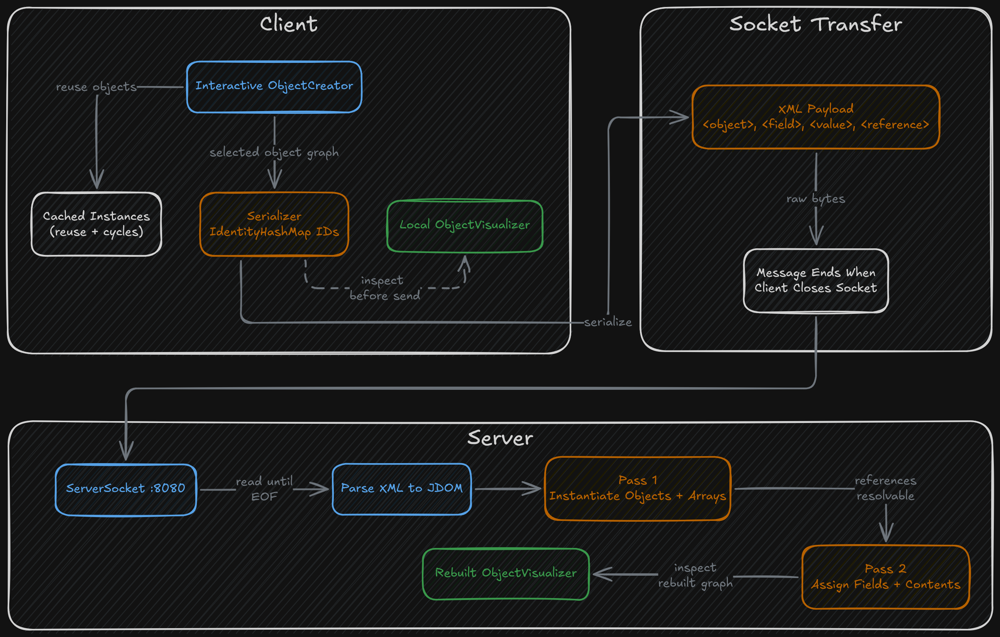

## Overview

This project is a Java client/server prototype that builds runtime object graphs on the client, serializes them to XML, sends that XML across a raw socket connection, and reconstructs the same object graph on the server. The application is intentionally small, but it covers a full end-to-end path: object creation, serialization, network transfer, deserialization, and post-transfer inspection.

The implementation is centered on a plain TCP connection rather than a higher-level messaging framework. The client connects to `localhost:8080`, sends a single serialized payload, and closes the socket. The server listens on the same port, reads until the client disconnects, treats the full input as one XML message, and then deserializes it. That makes the communication model straightforward and easy to follow from the code.

## Client and Server Flow

The client starts as an interactive terminal application. It does not use a GUI window. Instead, it uses a terminal-driven input flow to let the user select a demo object type, fill constructor values, edit field values, and choose whether to reuse existing in-memory objects. Once an object graph has been assembled, the client serializes it into a JDOM XML document, converts that document into a string, prints the XML locally, writes the bytes to the socket, closes the connection, and then visualizes the original object graph in the terminal.

The server runs as a long-lived listener on port `8080`. For each accepted connection, it reads the incoming bytes until EOF, prints the raw XML it received, converts that XML string into a JDOM document, deserializes the object graph, and then prints a recursive visualization of the reconstructed object. The server handles one client connection at a time in a loop, so the runtime shape is simple and sequential rather than concurrent.

One of the most characteristic parts of the socket protocol is its minimalism. There is no response message, no explicit message length header, and no framing beyond the connection itself. The end of the message is defined entirely by the client closing the socket after transmission.

## Interactive Object Creation

The client-side object creation flow is implemented in `ObjectCreator.java`. This is more than a hard-coded demo chooser. The object creator uses reflection to inspect constructors and public fields, select the constructor with the fewest parameters, prompt the user for primitive and string inputs, and recursively build nested object values where needed.

The object creator supports a fixed set of demo object types that were chosen to exercise different serialization cases:

- a primitive-only object
- an object with nested references
- an object containing an array of primitives
- an object containing an array of references
- an object containing a collection of references
- an object containing circular references

The most distinctive part of this creation layer is that it caches objects already created during the session. When the user is assigning object-valued fields, they can reuse a previously created instance instead of always constructing a new one. That is what makes shared references and circular links possible in the client-side graph before serialization even begins.

## XML Serialization Model

Serialization is handled by `Serializer.java` and built around reflection plus JDOM. Each runtime object is represented as an `<object>` element with a `class` attribute and an `id` attribute. Arrays and collections also carry a `length` attribute. Fields are serialized as `<field>` elements containing either:

- `<value>` for primitives, strings, and nulls
- `<reference>` for object references

Arrays and collections are represented slightly differently from standard object fields. Their child values and references are written directly under the `<object>` node rather than being nested inside `<field>` tags.

The serializer uses an `IdentityHashMap` to track objects by reference identity, not by value equality. That matters because it preserves repeated references and prevents the same in-memory object from being serialized multiple times as if it were separate instances. Instead, the first occurrence gets a unique object ID and later occurrences point back to that ID through `<reference>` elements.

That identity-based mapping is what lets the serializer preserve object graphs that include:

- repeated references to the same object
- arrays of shared objects
- collections of shared objects
- circular reference structures

The serializer also emits custom class name strings for arrays, such as `[int` and `[objects.PrimObj`, so the XML protocol can distinguish array types when the server reconstructs them.

## Deserialization and Graph Reconstruction

Deserialization is implemented in `Deserializer.java`, and the core of the design is a two-pass rebuild.

In the first pass, the deserializer walks the XML and instantiates every object or array shell based on its `class` and `id` attributes. Those partially constructed instances are stored in a map keyed by object ID.

In the second pass, the deserializer walks the same XML again and fills in field values, array contents, and collection contents. Because all referenced objects already exist by the time values are assigned, the deserializer can resolve back-references safely.

This preallocation-first approach is the key mechanism that makes circular object graphs possible. Without it, a reference could point to an object that had not been created yet. With it, the graph can be stitched together after all nodes already exist.

The deserializer also converts primitive text back into concrete Java primitive values, recreates arrays with `Array.newInstance`, and uses reflective field lookup based on the `name` and `declaringclass` attributes stored in the XML.

## Object Visualization

The project includes a separate `ObjectVisualizer` that inspects the runtime object graph after creation on the client and again after reconstruction on the server. This visualizer is distinct from the serializer and deserializer. Its job is to make the in-memory structure readable in the terminal.

It can inspect:

- regular objects
- arrays
- collections

It also tracks visited instances so that recursive inspection does not loop forever when it encounters circular references. That makes it a useful verification layer for this project, because it shows the shape of the graph without requiring the XML itself to be read directly.

In effect, the visualizer acts as the human-facing confirmation step: the client can inspect what it built before sending it, and the server can inspect what it reconstructed after receiving it.

## Testing Surface

The repository includes JUnit coverage for both serialization and deserialization. The serializer tests compare generated XML against expected XML structures, while the deserializer tests rebuild objects from XML and compare the resulting objects against expected fixture instances.

The test cases cover the main supported object patterns:

- primitive-only objects
- objects with nested references
- arrays of primitives
- arrays of object references
- collections of references
- circular reference structures

That gives the project a clear correctness surface: it is not only a socket demo, and it is not only an XML formatter. The serialization format and the reconstruction logic are both exercised directly.

## Signing Off

This project did two big things for me that I’ll never forget. First, it taught me how to communicate directly over a transport-layer protocol like TCP. Second, it gave me the chance to not only serialize payloads, but also deserialize them using a custom scheme. These kinds of low-level projects provide not just valuable insight, but real hands-on experience for understanding more complex, purpose-built applications.

I got to learn about terminal-driven object construction, reflection-based field and constructor handling, custom serialization/deserialization protocols, TCP socket transport, and recursive object visualization!

Definitely a project I’ll keep in my back pocket for whenever I want to revisit the good old days of “getting my hands dirty” at a low level. I feel like that’s the kind of thing that’s easy to lose sight of as we keep building on the shoulders of giants!
