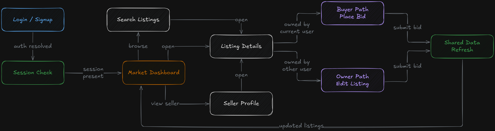
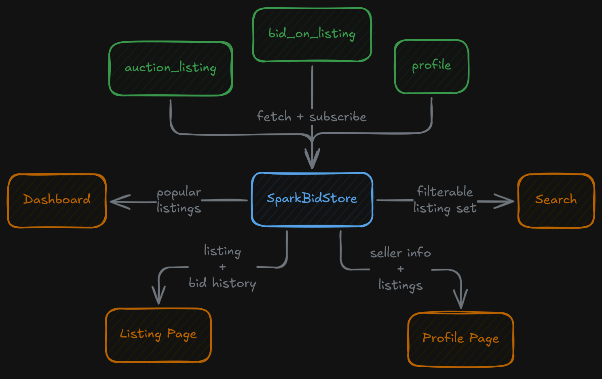
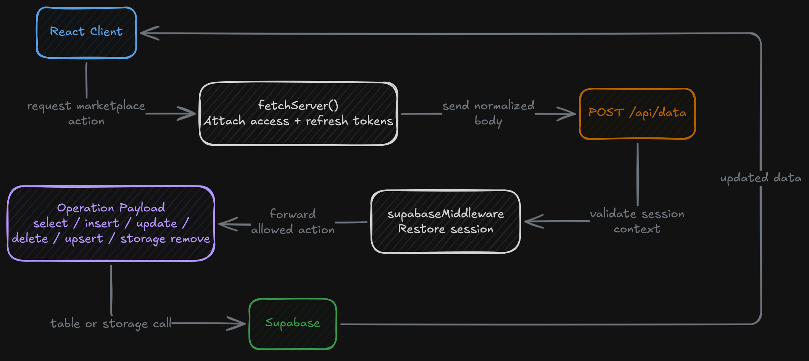

## Overview

Spark Bid is a full-stack marketplace web application built around time-based auction listings, account-backed bidding, and seller profile pages. The project is split into a React frontend and a small Express backend, with Supabase used for authentication, data storage, realtime updates, and image storage. Most of the application is organized around a client-driven marketplace UI backed by a generic server-side data bridge, rather than a heavy business-logic backend.

At a feature level, the application combines listing creation, listing discovery, bid placement, profile browsing, and subscription-style seller following. It's a marketplace prototype focused more on the live listing and bidding experience than on checkout or payment processing.

## Frontend Application Structure

The frontend is organized as a route-based React application. Public entry points include login, signup, and account confirmation screens. Once a user session is present, the application routes into the main marketplace pages: the home dashboard, listing detail pages, search, personal listings, bid history, profile views, and a subscribed-user feed.

Route access is controlled through a session check in a custom `useAuth` hook. The hook reads the current Supabase session on startup, listens for auth state changes, and exposes both `session` and `loading` state to the rest of the UI. The top-level `App` component uses that session state to redirect users into the authenticated portion and prevent protected pages from rendering before session state is resolved.

The UI is built around a dashboard pattern. Navigation buttons move between core marketplace areas, while individual screens focus on one workflow at a time. The structure is broad enough that it feels like an account-based platform, not just a single listing page with a bid form attached.

## Marketplace and Bidding Workflows

The home dashboard is centered on listing discovery. It computes a "popular listings" set by counting bids per listing, sorts active entries by bid volume, and surfaces both a featured item and a set of high-activity cards. The landing experience is driven by actual marketplace activity, not a static featured list.

Search is implemented as a local filtering view over the current listing dataset. As the query changes, the page filters listings by title and description and updates the results set in real time. The code keeps that flow lightweight by building it on the already-fetched listing state rather than by making a new backend request for each keystroke.

The listing detail page is where the auction logic becomes more specific. Each listing page resolves the current listing, gathers its bid history, computes the current highest bid, and then branches based on ownership:

- owners see an edit path for the listing
- non-owners see the bid panel

The bid panel supports two submission styles. A user can place a custom amount manually, or use a quick-bid action that automatically advances the current highest bid by the listing's configured increment. It feels closer to a marketplace interaction than a plain "submit number" form.

Seller-side listing management is handled through a reusable modal workflow. The listing wizard supports both creation and editing, keeps listing metadata in one local form object, and writes through the same persistence path in both modes. The form includes title, description, starting price, increment amount, finish time, and a multi-image upload flow. Images are compressed in the frontend before upload, then stored in Supabase storage and linked back to the listing through generated IDs. Listing deletion is handled from the owner view and uses the same generic backend data handler as the rest of the application.

## Shared Data Model and Realtime Behavior

The `SparkBidStore` context layer is one of the more interesting parts of the project. Instead of each page owning its own copy of listings, bids, and profile data, the frontend creates one shared store that fetches:

- `auction_listing`
- `bid_on_listing`
- `profile`

The store also subscribes to Supabase `postgres_changes` channels for all three tables. When any of those tables change, the corresponding dataset is refetched and the shared context state updates. The rest of the UI can treat listings, bid history, and user data as a shared live dataset instead of route-local state.

The profile data is also normalized into a user map keyed by ID, so screens like listing history, profile pages, and seller views can resolve user display information quickly without repeatedly searching arrays. A small structural choice that makes cross-linking between bids, listings, and seller identity much simpler throughout the frontend.

Profile pages extend the marketplace beyond listing ownership alone. A profile can display seller information, owned listings, and a subscription relationship driven by a `subscribed_to` array in the profile record — a small follow-based layer on top of the auction model.

## Backend Integration Model

The backend is intentionally narrow. Instead of exposing many resource-specific endpoints, it provides a single `/api/data` route that accepts an operation descriptor in the request body. The incoming payload specifies which table or storage bucket to target and which operation to perform: select, insert, update, delete, upsert, or storage removal.

The endpoint acts as a compact command bridge into Supabase. The server creates its own Supabase client from environment configuration, applies a session-aware middleware layer, and forwards the requested operation into the appropriate table or storage call. It's less of a traditional REST API and more of a controlled server-side database proxy.

The frontend complements this through `fetchServer()`, which reads the current auth session, attaches the access and refresh tokens to each request, and sends the request to the backend handler. The React client builds the operation payload, the server attaches database access, and Supabase remains the underlying persistence layer.

## Signing Off

This project was simply a way to explore some realtime capabilities and test out Supabase with a sprinkle of fun. It gave me a chance to explore the React ecosystem and take a stab at more architecture-focused coding practices. Overall, it was a great introduction to what it’s actually like to build full-stack applications, and what it takes to organize and architect them in a clean, efficient way.

I got to learn about:

- A route-based React frontend with protected, authenticated views
- A shared context layer for listings, bids, and profiles
- Supabase-backed auth, data access, storage, and realtime subscriptions
- An Express proxy endpoint that accepts generic database operation payloads
- Modal-driven CRUD flows for listing management
- Frontend image compression and upload handling
- Computed marketplace views like popular listings, bid history, and quick-bid actions
- Profile subscription behavior layered on top of the core listing system

Honestly, it was just a really nice experience building out a web app that looks good, runs smoothly, and supports a hypothetical business case. It ended up being a solid playground for putting real-world software development principles into practice in a no-consequence environment.
