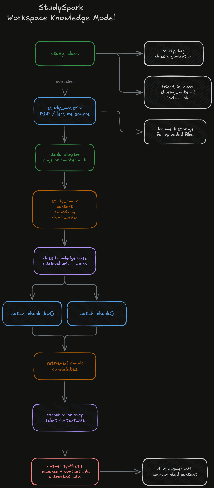
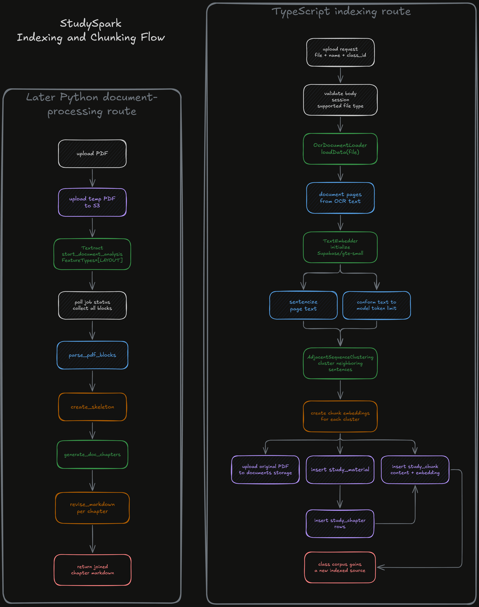
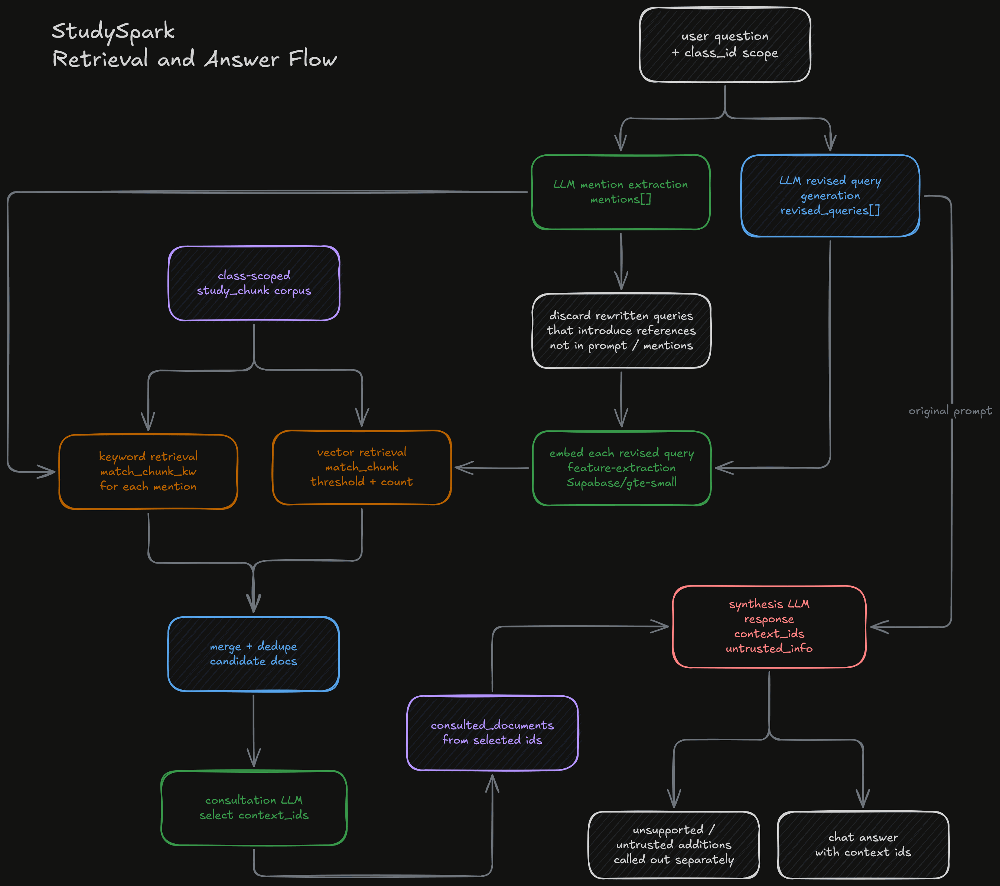

## Overview

StudySpark is a study-assistant web application built around classes, lecture documents, and AI-assisted querying. At the surface level, it is easy to describe: sign in, organize course material by class, upload documents, open lectures in the browser, and ask questions against the material. What makes the project much more substantial is the amount of infrastructure sitting underneath that user flow. The repository combines account-backed study organization, document storage, OCR and indexing work, hybrid retrieval, and answer synthesis into one application instead of treating those pieces as separate experiments.

The project is also valuable as an archive because it preserves more than one stage of the system. The visible app routes show a complete study workspace with class dashboards, upload pages, lecture viewing, chat, profile management, and invite flows. Underneath that, the repository contains multiple AI and document-processing pipelines rather than one fixed final implementation. One route family builds a retrieval flow in SvelteKit and TypeScript, storing chunks and embeddings inside Supabase. Another route family, wired through Vercel to Python, focuses more heavily on document layout analysis, chapter reconstruction, and markdown generation. That means the archive captures a real period of iteration rather than a single frozen architecture.

This is what gives StudySpark most of its technical weight. The project is not just "ask a model questions about a PDF." It is an attempt to build a usable study system around course material, where storage, retrieval, structure, and citation all matter. The code shows a consistent interest in keeping answers connected to specific study documents and specific pages instead of treating AI output as detached from the source material.

## Why I Needed It

The main problem StudySpark is trying to solve is the friction of studying from large course documents. Lecture slides, class notes, and scanned materials are easy to collect but hard to use once they start piling up. A student can store the files in folders, but that does not automatically make the contents searchable in a meaningful way. Traditional text search also tends to break down once the question stops looking like the exact wording of the slide deck and starts looking like an actual study question.

StudySpark approaches that problem by making the class itself the center of the experience. Instead of uploading documents into one flat list, the app groups material under `study_class` records and then attaches documents, chapters, chunks, tags, and sharing rules to that class context. This matters because it keeps retrieval scoped. The user is not asking the system to search every document they have ever uploaded. They are asking questions within the boundary of one course and its materials.

The project also tries to keep the source material close to the answer. That is visible in the lecture-view flow and in the chat interface. Documents are stored and reopened as actual lecture files. Chat responses carry `context_ids`, and the UI uses those IDs to resolve back to a lecture title and page number. The result is a study workflow that is trying to stay grounded in the underlying material instead of producing a detached answer with no path back to the lecture.

This is one of the reasons the project feels more practical than a generic AI demo. The goal is not just to generate a plausible response. The goal is to make course material easier to navigate, query, and revisit while preserving enough structure that the user can still inspect the original document when needed.

## The Study Workspace

StudySpark starts with an authenticated application shell. The login flow is Google-backed, and once a session exists the user is routed into the main app layout. From there the user can create or select study classes, move between class-specific pages, and work inside a persistent account rather than inside a single anonymous session.

The class dashboard is the operational center of the app. Each class has its own title, document list, tag editing entry point, chat entry point, and upload entry point. Documents can be renamed and deleted from the dashboard, which makes the workflow feel like a maintained study workspace rather than a one-time upload screen.

Uploading is handled through a dedicated route. In the visible current UI, the upload page accepts PDF files, associates a user-provided document name with the upload, and scopes the document to the active class. Once the processing request is sent, the frontend refreshes the study-class and study-material stores and routes the user back into the class view.

Lecture viewing is a separate workflow instead of an afterthought. The lecture route downloads the selected file from Supabase storage, reconstructs it as a browser file object, and passes it into a PDF viewer component. That means the application is not only indexing the document behind the scenes. It is still preserving the file as a readable artifact that the student can open directly.

Chat is the retrieval-facing workflow. The chat page is scoped to the active class and presents a query area, a response panel, and a reference list. When the system has relevant `context_ids`, the UI resolves those IDs back into links pointing to a specific lecture and page number. If the response synthesis included any `untrusted_info`, the UI surfaces that separately instead of blending it invisibly into the cited material. That is one of the most careful parts of the product behavior. It recognizes that an AI answer may rely partly on stored material and partly on model memory, and it keeps those two sources visible to the user.

The project also goes beyond solo use. The schema and routes include invite links, friend relationships, and `friend_in_class` membership. The profile route exposes friendship and invitation behavior, and the database policies are designed so class access can extend beyond the owner when the right relationship exists. The collaborative surface is lighter than the core study workflow, but it is still part of the design. StudySpark is framed as a class-centric study space that can be shared, not just as a personal notebook.

## The System Underneath It

At the application level, StudySpark is organized as a SvelteKit frontend backed by Supabase auth, storage, and Postgres. The frontend relies heavily on generated database types and a generic store abstraction rather than on hand-written fetch logic for every table. `SupaSvelteStore` and the study context layer create a consistent pattern for loading and mutating `study_class`, `study_material`, `study_tag`, `study_chapter`, `study_chunk`, and `friend_in_class` data inside Svelte state.

That design is useful because the application is working with several related entities at once. A study class owns many materials. A material leads to chapters. Chapters lead to chunks. Chunks become retrieval candidates. Tags and sharing rules sit around that same graph. The generic store layer keeps those tables accessible through the same overall interface, which makes the app feel more cohesive as the number of moving parts increases.

The database model reflects the same intent. `study_material` stores the uploaded file and the class relationship. `study_chapter` stores per-page or per-section breakdowns. `study_chunk` stores the smaller retrieval units and, when applicable, their embeddings. That means retrieval is not being done directly against whole files. The system is deliberately converting documents into intermediate structures that are better suited to search and answer synthesis.

Storage and access control are also real parts of the design, not details left for later. Lecture files live in a Supabase storage bucket and can be removed when a document is deleted. The migration file defines row-level security behavior across study classes, materials, chapters, and chunks, and it includes policies that allow class owners and valid class members to select the relevant rows. In addition, the schema introduces `invite_link`, `friends_with`, `friend_in_class`, and `sharing_material`, which shows that the app was being designed as a managed multi-user workspace rather than as a single-user upload bucket.

This implementation style is important for understanding the project honestly. StudySpark is not interesting because it uses a large number of technologies by itself. It is interesting because those pieces are coordinated around one concrete problem: keep course documents available, index them into smaller retrieval units, scope them by class, and return answers that still point back to the original material.

## Retrieval and Answer Synthesis

The most substantial part of StudySpark is the way it handles document understanding and retrieval, and the archive preserves more than one version of that work.

The older TypeScript indexing flow is built directly inside SvelteKit. In that path, the server route accepts an uploaded file, validates the active user and class, then loads the document through `OcrDocumentLoader`. From there the code initializes a local embedding model with `Supabase/gte-small`, runs an `AdjacentSequenceClustering` strategy across the document pages, and then prepares the output for database insertion. The resulting document is stored as a `study_material`, the processed pages are stored as `study_chapter` rows, and the final chunks are stored as `study_chunk` rows along with serialized embeddings. At the same time, the original file is uploaded to Supabase storage so the indexed document still remains available for direct viewing.

That ingestion path already shows a fairly broad view of the problem. It is not only parsing text. It is performing OCR-oriented loading, chunking the result into smaller semantic units, preserving the original file, and splitting the processed content into a retrievable database shape. The indexing route also includes a summarization pass through `PageSummarization`, although in the current archive that stage appears much lighter and less central than the rest of the retrieval pipeline.

The older search route is even more involved. Rather than embedding only the raw user prompt and doing one nearest-neighbor lookup, the project builds a multi-stage retrieval workflow. It first asks a model to extract the important mentions from the query. It then asks the model again to produce revised queries that would help gather broader context for answering the original prompt. Those revised queries are embedded locally, and the resulting vectors are passed into the `match_chunk` RPC in Supabase. In parallel, the extracted mentions are sent into a `match_chunk_kw` RPC for keyword-style retrieval. The two result sets are then merged and deduplicated.

That hybrid approach is one of the clearest signs of technical intent in the code. The project is not relying on a single retrieval strategy. It is combining vector search with keyword search and then layering a second AI selection step on top. After the merged candidate set is gathered, another model call acts as a consultant and chooses which context items are actually relevant to the question. Only after that filtering step does the system send the remaining context into the synthesis stage.

The synthesis stage is also structured carefully. The final response is requested through a function-shaped schema that requires three outputs:

- the natural-language response
- the list of context IDs used
- the list of `untrusted_info` items that came from model memory rather than retrieved material

That last field is one of the most interesting details in the entire repository. It shows that the system was not treating citation as all-or-nothing. The route explicitly assumes that a good answer may sometimes include model knowledge beyond the retrieved text, but it still tries to surface that difference instead of burying it. The chat UI follows through on that idea by rendering referenced lecture material separately from the uncited memory-based additions.

The search route even logs rough prompt and completion cost calculations for the different model calls. That is a small but revealing choice. It suggests that the project was not only exploring retrieval quality. It was also paying attention to the practical cost of a multi-stage prompt chain.

## An Archive of an Evolving System

Alongside that TypeScript pipeline, the repo preserves a later Python-backed direction for document processing. `vercel.json` routes `/api/*` requests into a Flask app, and the visible Python indexing route takes a different approach to ingestion. Instead of immediately producing stored chunks for hybrid retrieval, it uploads the PDF to S3, runs AWS Textract layout analysis, gathers the resulting blocks, parses them into document structure, generates a chapter skeleton, builds chapter representations, revises the resulting markdown, and returns compiled markdown to the caller. That route also calculates approximate run costs based on page count and model usage.

This Python path is important because it shows the project evolving. The archive contains a retrieval-oriented indexing flow on one side and a more structure-reconstruction-oriented document pipeline on the other. Those are not the same architecture, and the repo does not present them as a single polished final system. Instead, it preserves a period of active experimentation in which document understanding, chunking, retrieval, and presentation were still being refined.

That is the right way to understand StudySpark. Its technical value does not come from claiming one perfect final pipeline. It comes from the fact that the archive shows several hard problems being worked through in code:

- how to ingest noisy study documents
- how to break them into useful retrieval units
- how to store those units with enough structure to support later navigation
- how to combine vector and keyword retrieval
- how to keep AI answers tied back to a lecture and page

Even where the system is visibly in motion, the design intent stays consistent. The project keeps pulling toward the same end state: answers should be grounded in the material, documents should remain inspectable, and retrieval should be good enough to help with real study questions rather than only exact text lookups.

## Signing Off

This was the big one for me. It is the first AI project that really feels like it has some weight to it because it was solving a problem I actually cared about while I was in the middle of classes. It also was the combination of countless research articles and white-papers that I bootstrapped into something truly spectacular that works! I didn't want to build just a demo and leave it there, I wanted something that could take my course material, make it searchable, and give me a better way to work through it!

What I still like most about it is that the ambition stays tied to the product behavior. The app is not satisfied with generating an answer. It tries to organize the class, preserve the lecture, retrieve the relevant context, and point me back to the source. That is what makes the project feel meaningful to me even with all the visible iteration in the archive.

The fact that I can grab the most bleeding edge techniques, replicate them within my own work, then use it in a practical way is just truly special! That kind of feeling is so empowering, and something I'll never forget!
