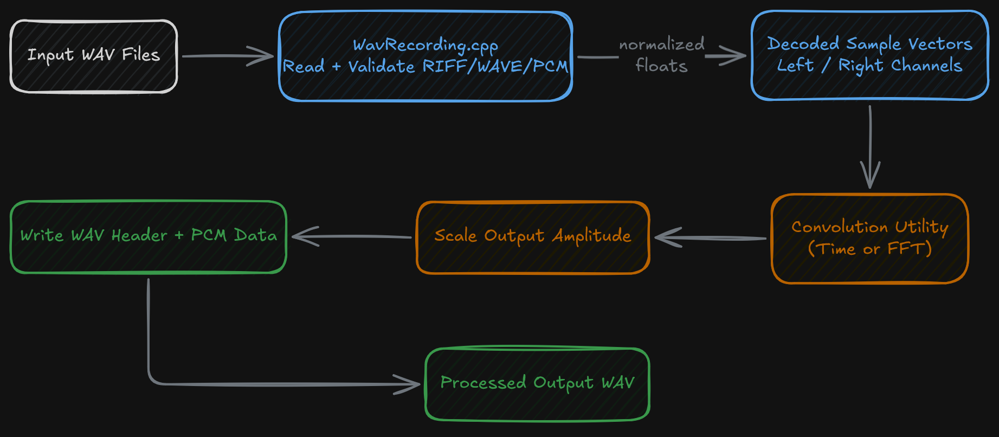
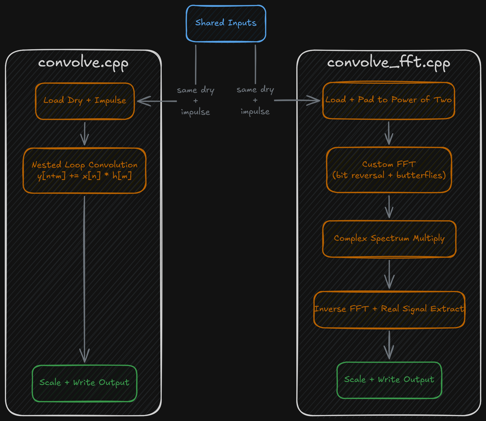
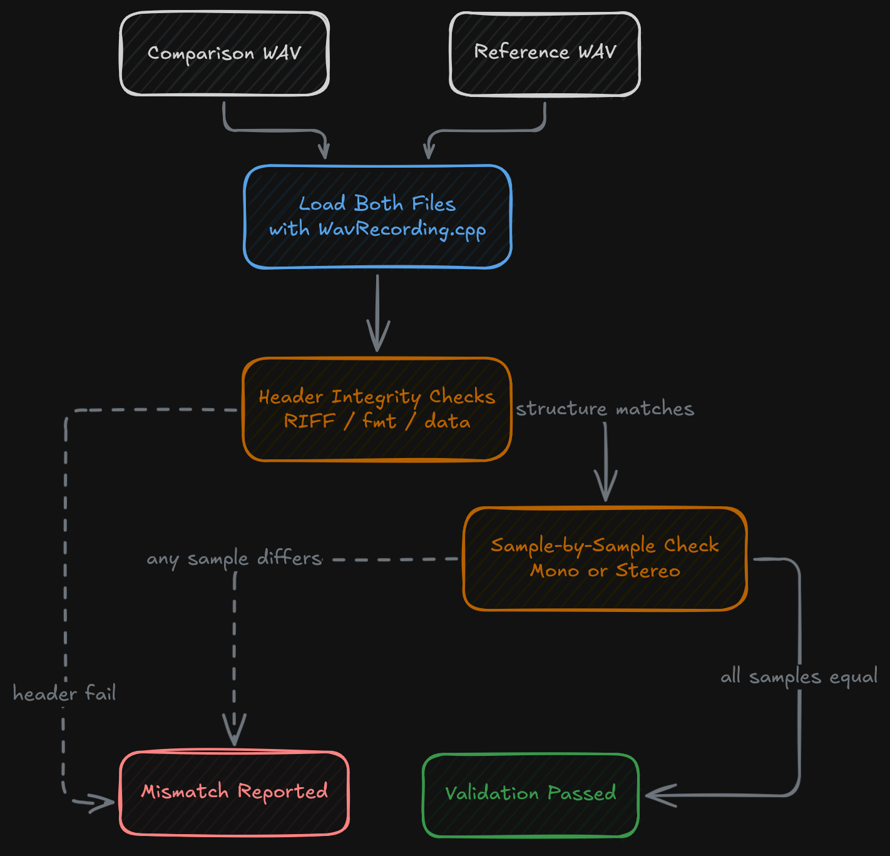

## Overview

This project is a small C++ toolkit for reading WAV audio files, applying convolution-based processing, and validating generated output against a reference recording. Instead of being structured as one monolithic audio application, it is split into a set of focused command-line utilities that share the same WAV parsing and file-writing layer.

The repository contains four main pieces:

- `WavRecording.cpp` for WAV parsing, metadata extraction, and WAV output helpers
- `convolve.cpp` for direct time-domain convolution
- `convolve_fft.cpp` for FFT-based convolution in the frequency domain
- `regression.cpp` for comparing two WAV files at both header and signal-data levels

Taken together, the project reads as a compact audio-processing lab: one shared file-format layer, two different convolution strategies, and one validation utility for checking output correctness.

## WAV File Handling

The shared file-format work lives in `WavRecording.cpp`. This file defines a `WavFile` structure that stores both header metadata and decoded audio signal data. The parser reads the WAV file in binary form, validates the expected `RIFF`, `WAVE`, and `fmt ` markers, checks that the format is PCM, handles extended format chunks when present, and then reads the raw audio payload into memory.

From there, the code converts the raw PCM bytes into normalized floating-point samples. Mono and stereo files are both supported:

- mono files populate the left channel only
- stereo files populate both left and right channel vectors

The parser also computes a `signalLength`, tracks whether the source is stereo, and stores the key WAV header fields so the rest of the programs can work from one consistent in-memory representation.

The same file also provides the write path. It includes helpers for writing little-endian integers and shorts, writing the WAV header, and writing PCM sample data back to disk. That means the toolkit is not only reading WAV files; it fully owns the conversion from file bytes to sample vectors and then back from processed sample data to a valid output file.

## Time-Domain Convolution

`convolve.cpp` implements direct time-domain convolution. It loads a dry input recording and an impulse response, allocates an output buffer sized to `N + M - 1`, and then performs the standard nested-loop convolution:

- iterate over the dry signal
- iterate over the impulse response
- accumulate products into the shifted output sample

This version is the more straightforward implementation. It is easy to follow mathematically and maps directly to the textbook discrete convolution process.

After convolution, the program scales the output signal so the processed result stays within a usable amplitude range relative to the original input. It then converts the floating-point output back to 16-bit sample values, writes the result as a WAV file, and reports the total runtime. That makes this utility both a processing tool and a timing baseline for comparison with the FFT version.

## FFT-Based Convolution

`convolve_fft.cpp` implements the same general effect through frequency-domain processing. Instead of multiplying every input sample against every impulse sample directly in the time domain, it:

- loads the dry signal and impulse response
- pads the signals to a power-of-two size
- runs a Fast Fourier Transform
- multiplies the complex frequency-domain components
- runs the inverse transform
- extracts the time-domain output samples
- scales and writes the result

The FFT implementation is written directly in C++, including the transform routine itself. The code includes:

- a manual bit-reversal reordering stage
- iterative butterfly stages
- complex multiplication for paired real/imaginary values
- inverse transform execution by calling the same FFT routine with a negative sign

That makes this utility more than a wrapper around a DSP library. It contains the transform and convolution mechanics in the source itself.

The code also handles stereo impulse responses by producing separate left and right processed outputs when needed. As in the time-domain version, the final signal is scaled and converted back into 16-bit PCM before being written to disk.

This file is the most algorithmically dense part of the toolkit. It is where the project moves from basic file manipulation into a more explicit digital signal processing implementation.

## Output Comparison and Regression Checking

`regression.cpp` is the validation tool in the repository. Instead of generating audio, it compares two WAV files and checks whether they match structurally and sample-for-sample.

The comparison process is split into stages:

- RIFF chunk validation
- format chunk validation
- data chunk validation
- signal comparison

At the header level, it checks the key identifier fields and the main WAV metadata fields such as channel count, sample rate, byte rate, block alignment, and bits per sample. At the data level, it verifies that the signal lengths match and then compares the sample values across the waveform data.

The comparison logic handles both mono and stereo recordings. Stereo comparisons validate both channels together, while mono comparisons verify the left-channel data only. The program emits specific messages when a mismatch is found, which makes it useful as a quick regression checker for generated output.

This gives the toolkit a built-in verification step. It is not just producing processed WAV files; it also includes a command-line utility for checking whether a generated file still matches an expected result.

## Shared Design Across the Utilities

One of the stronger characteristics of the project is that the tools are separate, but they all rely on the same internal representation of audio data. The WAV parser produces normalized floating-point sample vectors, the processing utilities operate on those vectors, and the write helpers convert the processed samples back into standard PCM output.

That shared structure keeps the programs aligned:

- parsing happens once in a common format
- processing happens on vectors of samples
- output happens through the same write helpers
- validation reads the same structure back for comparison

This makes the repository feel like a small toolkit rather than a set of unrelated experiments.

## Signing Off

This project really peeled back the curtain on some of the basic technologies we take for granted every day. It’s rare that we actually dive into the byte-level structure of something like an audio file, and this project showed me not only how audio files are built, but also how they can be manipulated!

Figuring out how to map certain audio characteristics onto another piece of audio, and then improve the algorithmic efficiency to do it with fewer resources was both genuinely confusing and exciting! It gave me the chance to really dive deep into the 1s and 0s of WAV files. I got to understand audio header structures, PCM metadata validation, stereo channel handling, sample-vector processing, convolution algorithms, and much more!

It was definitely a low-level and complex project, but one that gives you a much deeper appreciation for the everyday technologies our world is built on! Very reminiscent of the feeling I had when I first learned physics!
