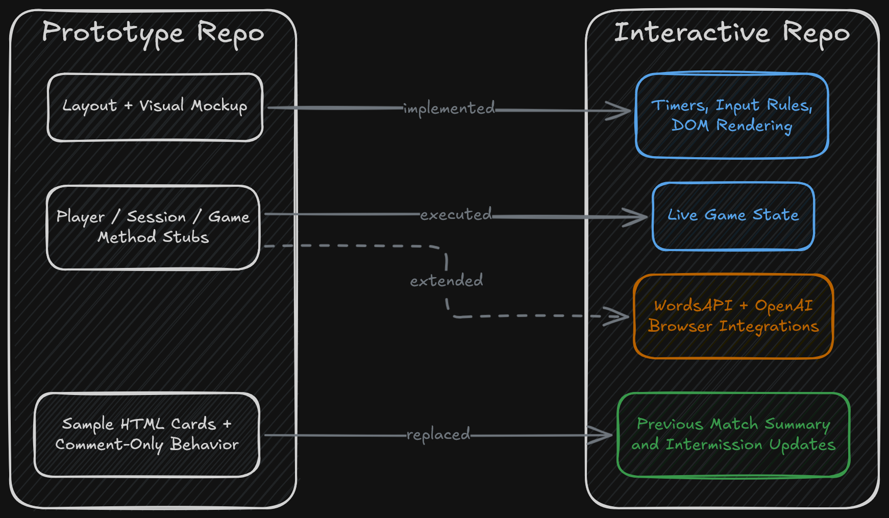
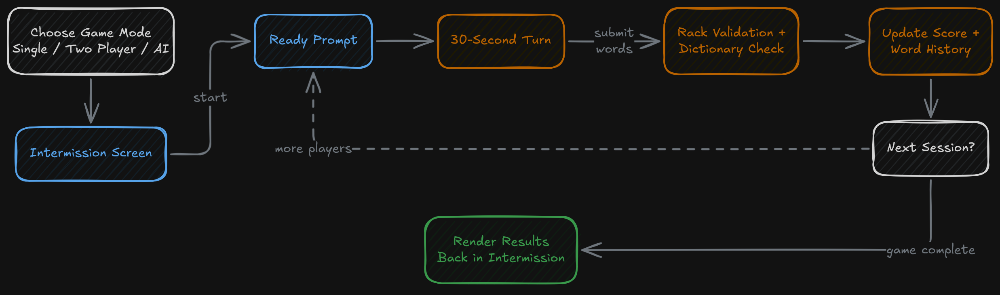
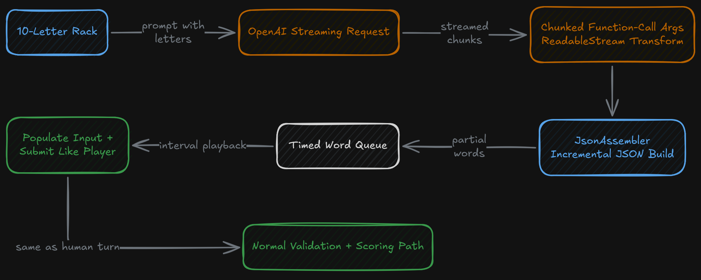

## Overview

These two repositories are best understood as one project in two forms: a scaffolded version and a fully implemented browser game. Both are built as plain front-end applications using `HTML`, `CSS`, and vanilla `JavaScript`, with no build step and no backend service. The core idea in both is the same: a timed word game where players build words from a constrained set of letters and score points based on valid submissions.

The `Word-Blast-Word-Duel-Prototype` repository preserves the structural plan for the game. The `Word-Blast-Interactive-Word-Duel` repository contains the live runtime: working game state, timers, DOM updates, API-backed validation, and AI turns. Taken together, they show both the designed architecture and the implemented version of the same game loop.

## Shared Game Concept

The game is built around a short-turn word duel. A player receives a rack of 10 letters and has 30 seconds to submit as many valid words or references as possible. The scoring model is simple:

- valid words earn points based on word length
- invalid submissions lose points

The game supports multiple modes:

- single player
- two player
- AI mode

At the end of a turn, control rotates to the next player. After all turns in the current game are complete, the game returns to an intermission state and displays the results from the completed session.

This structure makes the project more than a one-screen word checker. It includes a reusable game cycle with turn sequencing, intermission state, and match results.

## Prototype and Interactive Progression

The prototype repository keeps the intended architecture visible, but most of its game logic remains in descriptive stubs. Its `scripts.js` file preserves the class layout, method names, and behavior notes, while the HTML includes placeholder content and sample game cards. It reads like a planned runtime with the interface and logic boundaries already mapped out.

The interactive repository takes that same shape and fills it in with executable behavior. The placeholder UI is replaced by live rendering, event listeners, timers, validation, score tracking, and mode selection. The class structure remains recognizable between the two versions, which makes the pair useful as a before-and-after view of the same design moving from stubbed intent into working browser code.

Even if the exact development timeline was not a strict prototype-then-build sequence, the two repositories still serve as a useful split between planned structure and implemented runtime.

## Runtime Architecture

The implemented game is organized around three core classes:

- `Player`
- `Session`
- `Game`

`Player` stores player identity, score, word history, and AI-specific runtime state. `Session` controls one timed turn, including letter generation, input validation, score updates, and timer control. `Game` manages the sequence of sessions, rotates through players, and returns the application to the intermission state when all sessions are complete.

That separation gives the project a clear client-side state model:

- player-level persistent data
- session-level turn data
- game-level orchestration

For a small vanilla JavaScript browser game, this is a notably structured implementation. It avoids collapsing everything into a single procedural script and instead uses explicit runtime objects to model the game loop.

## Input Constraints and Turn Logic

One of the most characteristic parts of the game is the letter-rack validation logic. Each session generates a 10-letter lineup and guarantees that at least three of those letters are vowels. The player is only allowed to use letters that actually appear in that lineup, and duplicate letters can only be used as many times as they are present in the rack.

The input handling enforces that rule in real time:

- invalid characters can be blocked during typing
- already-used words can be rejected
- character tiles are visually marked as in-use or unused

That makes the rack more than a static display. It is part of both the scoring rules and the live input constraint system.

The game also updates the score and the current word list immediately after each submission, and it keeps valid and invalid words separated by visual state. Score and timer colors shift based on game conditions, so visual feedback is tied directly to the game state rather than added only as decoration.

## API-Backed Word Validation

The interactive version uses external APIs directly from the browser. For normal player submissions, the game sends a dictionary lookup request through WordsAPI via RapidAPI. If a definition is returned, the word is treated as valid and earns points. If the request fails or no usable definition is returned, the submission is treated as invalid and costs a point.

This gives the game a runtime validation path that is based on an external dictionary source rather than only a local word list or hard-coded rule set. It also means that the browser version is not purely self-contained logic; it includes live network-dependent validation as part of the play loop.

## AI Mode and Streaming JSON Assembly

The most distinctive technical feature in the interactive version is the AI mode.

In AI turns, the game calls the OpenAI chat completions API directly from the browser and asks it to generate candidate words from the current letter rack. The response is requested as a streamed function-call payload rather than a single final response. The script then manually processes the streamed chunks, extracts the incremental function-call arguments, and feeds them into a custom `JsonAssembler`.

The `JsonAssembler` is a separate utility that incrementally reconstructs structured JSON from streamed text fragments. Instead of waiting for a full JSON string first, it parses the incoming text as it arrives and emits partial updates as the `words` array becomes available.

That parsed word stream is then pushed into a timed submission queue. The result is that AI words are not only generated; they are fed back through the same input and submission flow used by a human player, which makes the AI turn behave like an in-game participant rather than a separate scoring shortcut.

This is the most technically unusual part of the project:

- stream processing in the browser
- incremental JSON reconstruction
- API-generated word candidates
- timed queue playback that mimics player input

For a small browser game, that is a relatively sophisticated integration pattern.

## UI Behavior

The interface is built as a two-state layout:

- an intermission/results panel
- an active play panel

The intermission view handles mode selection, readiness prompts, and prior game summaries. The play panel handles the active timer, score, word input, letter rack, and submitted words. Valid words can also be toggled to reveal their definitions, which gives the word list a second interactive layer beyond simple score feedback.

The UI behavior is driven directly from DOM manipulation and event listeners in the script rather than from a front-end framework. That makes the project a good example of a structured vanilla JavaScript interface with non-trivial runtime state.

## Signing Off

This project brought together a lot of my passions into one! I got the chance to work with AI at a low level to build something interactive and fun, while also managing state pipelines to make sure the user experience felt actually enjoyable. It was a great opportunity to see what pure JavaScript, HTML, and CSS could really do, especially when I had a clear progression plan that helped keep me on track, and iterate effectively.

The hardest part was definitely the JSON assembler. Trying to optimistically produce valid JSON structures with missing tokens is definitely a challenge, but I also think it's the kind of algorithm that could have serious applications elsewhere (especially in more real-time, interactive AI experiences). I’d definitely encourage anyone reading this to take a stab at something similar, whether it’s to explore a technology you’re interested in or just to have some fun in the process!
